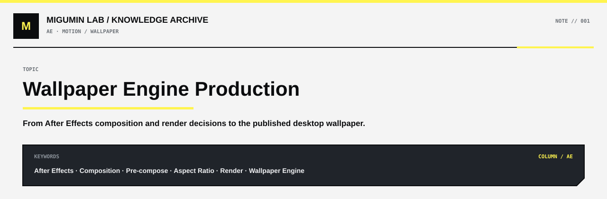

  

  <a href="../README.md#ae">← AE</a> ·
  <a href="../README.md#map">KNOWLEDGE MAP</a> ·
  <a href="https://github.com/Retourflow">PROFILE</a>

---

# Wallpaper Engine 动态壁纸制作记录

这篇记录对应今天完成并发布的一张动态壁纸。

## 成品

**Steam Workshop**

[查看最终发布作品](https://steamcommunity.com/sharedfiles/filedetails/?id=3804142795)

---

## 本次制作重点

这次主要是在 After Effects 里完成最终桌面版本，并针对实际 Wallpaper Engine 使用场景重新检查了构图和输出。

过程中重点处理了：

- 合成尺寸与实际桌面画幅之间的关系
- 16:9 素材放进更宽/更高桌面比例时的边缘显示问题
- 通过预合成统一控制最终画面
- 检查最终输出参数和渲染结果
- 对比 AE 中的画面与真正应用到 Wallpaper Engine 后的显示效果

这次最明显的感受是：

> **AE 里“看起来完整”不代表放进 Wallpaper Engine 后就一定完整。**

最终显示效果还会受到桌面分辨率、画幅比例、Wallpaper Engine 的适配方式以及输出清晰度影响。

---

## 记录关键词

`After Effects` · `Composition` · `Pre-compose` · `Aspect Ratio` · `Render` · `Wallpaper Engine`
