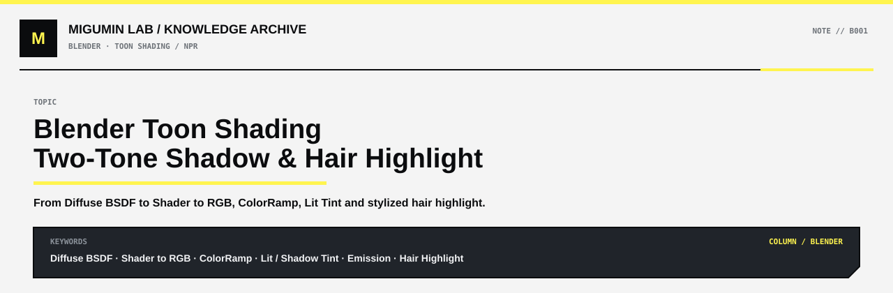

<p align="center">
  
</p>

<p align="center">
  <a href="../README.md#blender">← BLENDER</a> ·
  <a href="../README.md#map">KNOWLEDGE MAP</a> ·
  <a href="https://github.com/Retourflow">PROFILE</a>
</p>

---

# Blender 三渲二二分阴影与头发高光学习笔记

> 主题：Eevee 三渲二基础、二分阴影、亮部压色、头发高光  
> 目标：理解 `Diffuse BSDF → Shader to RGB → ColorRamp → Base Color → Emission` 这一套经典 Toon Shader 的工作逻辑。

---

## 核心结论

三渲二里：

> **没有进入阴影，不代表颜色一定等于原始 Base Color。**

因为最终显示的颜色通常不是直接输出贴图，而是：

```text
Base Color
    ↓
受光结果 / Toon 分区
    ↓
亮部颜色 / 阴影颜色
    ↓
最终颜色
```

所以白色或浅色头发即使位于“亮部”，也可以被设计成浅蓝灰、浅灰等颜色，从而比原始贴图更深。

---

## Base Color、Lit Color、Shadow Color

这三个概念需要明确区分。

### Base Color

`Base Color` 是贴图本来的颜色。

例如白发贴图可能接近：

```text
RGB ≈ (0.95, 0.95, 1.00)
```

它只是“材质本色”，并不一定是最终画面中直接显示的颜色。

### Lit Color

`Lit Color` 是亮面最终使用的颜色。

亮面不一定是纯白，也不一定等于原贴图。

例如：

```text
Lit Tint = (0.78, 0.84, 0.92)
```

那么：

```text
Base Color × Lit Tint
```

之后，原本很白的头发就会变成浅蓝灰。

### Shadow Color

`Shadow Color` 是进入 Toon 阴影区域后的颜色。

例如：

```text
Shadow Tint = (0.38, 0.46, 0.60)
```

因此一个典型白发材质可能是：

```text
Base Color
    ↓
Lit Color：浅蓝灰
    ↓
Shadow Color：深蓝灰
```

而不是：

```text
Base Color = 白色
Shadow = 在白色上盖一层黑
```

---

## 为什么“没有阴影”的头发也会变深

关键是：

> **没有阴影 ≠ 没有光照处理。**

三渲二中，亮部本身也可以经过颜色设计。

例如：

```text
原始贴图：100% 白
亮部颜色：80% 亮度的浅蓝灰
阴影颜色：45% 亮度的深蓝灰
```

结果：

```text
Base Color      100%
      ↓
Lit Color        80%
      ↓
Shadow Color     45%
```

所以即使当前区域没有进入 Toon Shadow，它仍然可以比原贴图更深。

对于白发尤其常见，因为如果亮部直接保持纯白：

```text
(1, 1, 1)
```

那么后续高光就几乎没有继续变亮的空间。

因此二次元角色经常故意把白发亮部压成：

```text
浅灰
浅蓝灰
浅紫灰
```

再用高光重新拉亮。

---

## Blender Eevee 最经典的基础三渲二节点

基础节点结构：

```text
Diffuse BSDF
     ↓
Shader to RGB
     ↓
ColorRamp
     ↓
Mix Color / Multiply
     ↑
Image Texture（Base Color）
     ↓
Emission
     ↓
Material Output
```

这是 Blender Eevee 中非常经典的 Toon Shader 入门结构。

可以把它看作 Blender NPR 的“Hello World”。

---

## 每个节点到底负责什么

### Diffuse BSDF

`Diffuse BSDF` 负责产生表面的漫反射受光结果。

它会根据：

```text
表面法线 Normal
光源方向 Light Direction
光照强度
光源颜色
阴影遮挡
```

等信息计算当前表面有多亮。

最基础的理论核心可以理解成：

\[
N \cdot L
\]

其中：

- `N` = Surface Normal，表面法线
- `L` = Light Direction，光线方向

当表面越朝向光源：

```text
N·L 越大 → 越亮
```

当表面越背向光源：

```text
N·L 越小 → 越暗
```

因此：

> `Diffuse BSDF` 才是负责“算当前表面亮不亮”的节点。

---

## Shader to RGB

`Diffuse BSDF` 输出的是 Shader，不是普通 RGB 数值。

普通颜色节点不能直接方便地读取这个 Shader 的光照结果。

所以需要：

```text
Diffuse BSDF
    ↓
Shader to RGB
```

`Shader to RGB` 的作用是：

> 把已经计算好的 Shader 光照结果转换成普通颜色数据。

注意：

`Shader to RGB` **不负责计算阴影**。

它只是：

```text
把 Diffuse BSDF 的结果拿出来
```

然后让 `ColorRamp`、`Math`、`Mix Color` 等普通节点可以继续处理。

---

## ColorRamp

`ColorRamp` 本身并不知道：

```text
光源在哪里
法线是什么方向
这里有没有被物体挡住
```

它只看到一个输入数值。

比如 Shader to RGB 输出：

```text
0.1
0.2
0.3
0.4
0.5
0.6
0.7
0.8
0.9
```

ColorRamp 根据这些数值重新映射输出。

因此最准确的理解是：

> `Diffuse BSDF` 负责产生明暗信息，`ColorRamp` 负责根据明暗信息划分色阶并输出对应颜色。

---

## ColorRamp 为什么能做“二分阴影”

普通 Diffuse 光照是连续变化的：

```text
0.1
0.2
0.3
0.4
0.5
0.6
0.7
0.8
0.9
```

视觉上是连续渐变。

如果在 `ColorRamp` 中把：

```text
Interpolation
```

改成：

```text
Constant
```

就可以人为设置一个阈值。

例如：

```text
0.0 ~ 0.49 → Shadow
0.5 ~ 1.0  → Lit
```

结果就变成：

```text
Shadow │ Lit
██████ │ ██████
       0.5
```

这就是典型的二分阴影。

所以：

> **二分阴影的本质，是把连续光照值通过 Threshold 阈值压成两个状态。**

可以简化理解为：

\[
Lighting \rightarrow Threshold \rightarrow 0/1
\]

---

## 更准确地理解“谁在判断阴影”

容易混淆的一点是：

```text
Diffuse BSDF
和
ColorRamp
```

分别在做什么。

正确理解：

### Diffuse BSDF

负责：

```text
算光照
算表面朝向光源后的明暗
接收实际灯光与阴影影响
```

### Shader to RGB

负责：

```text
把 Shader 结果转换成普通 RGB / 数值
```

### ColorRamp

负责：

```text
根据输入亮度划分区间
把区间重新映射成两档或多档颜色
```

因此一句最准确的总结是：

> **Diffuse BSDF 负责“算亮不亮”，Shader to RGB 负责“把结果拿出来”，ColorRamp 负责“把连续亮度切成几档并着色”。**

---

## Lighting / Shading 和 Cast Shadow 不是一回事

三渲二里所谓“阴影区”，不一定意味着真的有物体挡住光线。

例如一个表面没有被任何东西遮挡：

```text
Light
  ↘
    Surface
```

但因为表面法线没有正对光源：

\[
N \cdot L = 0.35
\]

假设 Toon 阈值是：

```text
0.5
```

那么：

```text
0.35 < 0.5
```

ColorRamp 就会把这块表面分到：

```text
Shadow Color
```

因此必须区分：

### Lighting / Shading

由：

```text
Normal
Light Direction
```

等因素产生的明暗变化。

### Cast Shadow

由其他物体真正挡住光线产生的投影。

所以：

> Toon Shadow 区域不一定等于真实 Cast Shadow。

它可能只是因为表面朝向导致受光值低于 Toon Threshold。

---

## ColorRamp 直接放颜色的做法

最简单的版本可以直接：

```text
ColorRamp
左边：Shadow Color
右边：Lit Color
```

例如：

```text
Shadow = 深蓝灰
Lit    = 浅蓝灰
```

然后：

```text
ColorRamp
    ↓
Multiply
    ↑
Base Color Texture
```

这样可以直接得到：

```text
Final Color = Base Color × Toon Color
```

例如：

```text
Base Color = (0.95, 0.95, 1.00)
Lit Color  = (0.78, 0.84, 0.92)
```

得到：

```text
Lit Result ≈ 浅蓝灰
```

所以即使没有进入阴影，头发也会比原贴图更深。

---

## 为什么 ColorRamp 右边不能总是纯白

如果亮部颜色是：

```text
(1, 1, 1)
```

那么：

\[
BaseColor \times 1 = BaseColor
\]

也就是说亮部完全保持原贴图颜色。

如果想让亮面整体变暗或带色，则把右侧改成：

```text
浅灰
浅蓝灰
浅紫灰
```

例如：

```text
Lit = (0.78, 0.84, 0.92)
```

那么白发即使处于亮部，也会带一点蓝灰。

因此：

> 想实现“亮部也变深”，不是去改 Shadow，而是去改 Lit Color。

---

## 更推荐的专业一点的结构

虽然可以直接让 `ColorRamp` 输出：

```text
Shadow Color
Lit Color
```

但长期做复杂 Toon Shader 时，更推荐把“阴影判断”和“颜色设计”拆开。

结构：

```text
Diffuse BSDF
     ↓
Shader to RGB
     ↓
ColorRamp（Constant）
     ↓
Black / White Mask
     ↓
Mix Color
  ┌──────────────┐
Shadow Tint    Lit Tint
  └──────┬───────┘
         ↓
Tone Color
         ↓
Multiply Base Color
         ↓
Emission
         ↓
Material Output
```

这样 `ColorRamp` 主要负责：

```text
哪里属于 Shadow
哪里属于 Lit
```

而：

```text
Shadow Tint
Lit Tint
```

单独控制颜色。

这样后面扩展更方便。

---

## 为什么这种结构更适合长期使用

以后不同材质可能拥有不同的颜色策略。

例如：

### 白发

```text
Shadow Tint = 冷蓝灰
Lit Tint    = 浅蓝灰
```

### 金发

```text
Shadow Tint = 橙棕
Lit Tint    = 暖黄色
```

### 黑发

```text
Shadow Tint = 深紫蓝
Lit Tint    = 灰紫色
```

如果所有颜色都直接塞进 ColorRamp，后期会越来越难管理。

拆开以后：

```text
Lighting Mask
      ↓
Color Design
      ↓
Material Color
```

结构更加清晰。

---

## 为什么最后常用 Emission

如果已经通过：

```text
Diffuse BSDF
→ Shader to RGB
→ ColorRamp
```

自己生成了 Toon 光照，然后又把结果接进：

```text
Principled BSDF Base Color
```

那么 Principled BSDF 会再次计算一次光照。

相当于：

```text
第一次：
自己计算 Toon Lighting

第二次：
Principled 再计算 PBR Lighting
```

容易导致：

```text
颜色变暗
阴影重复
效果不受控
Toon 色块被再次改变
```

因此经典 Eevee Toon Shader 常使用：

```text
最终 Toon Color
      ↓
Emission
      ↓
Material Output
```

这里使用 `Emission` 并不是为了让角色像灯泡一样发光。

而是为了表达：

> Toon Shader 已经自己决定了最终颜色，不希望普通 BSDF 再进行一次光照计算。

---

## 基础二分阴影推荐节点

当前学习阶段可以使用：

```text
Diffuse BSDF
     ↓
Shader to RGB
     ↓
ColorRamp
Interpolation = Constant
     ↓
Shadow / Lit Mask
     ↓
Mix Color
A = Shadow Tint
B = Lit Tint
     ↓
Multiply
A = Base Color Texture
B = Toon Tone Color
     ↓
Emission
     ↓
Material Output
```

这是非常适合学习三渲二光照逻辑的基础结构。

---

## 银白发的简单颜色示例

可以先尝试：

### Shadow Tint

```text
R = 0.38
G = 0.46
B = 0.60
```

### Lit Tint

```text
R = 0.78
G = 0.84
B = 0.92
```

### ColorRamp

```text
Interpolation = Constant
Threshold ≈ 0.45 ~ 0.60
```

这些不是固定答案，只是方便观察效果的学习参数。

真正制作角色时，需要根据：

```text
角色美术风格
环境光
光源颜色
头发 Base Color
整体色调
```

重新调整。

---

# 发丝高光 Hair Highlight

“发丝高光”是一个比较宽泛的概念。

它不完全等于：

```text
Anisotropic Specular
```

更准确地说：

```text
Hair Highlight
├─ Anisotropic Specular
├─ Stylized Hair Specular
├─ Hair Highlight Texture / Mask
├─ Tangent-based Highlight
└─ Ramp / MatCap Style Highlight
```

---

## 什么是各向异性高光

普通高光更容易形成接近圆形的亮斑：

```text
   ●
```

而头发由大量朝相似方向排列的发丝构成。

因此高光会沿某个方向拉长：

```text
────────────
```

这种方向性就是：

```text
Anisotropy
各向异性
```

所以真实头发、金属拉丝等材质常使用各向异性高光。

---

## 三渲二头发高光不一定直接用物理 Anisotropic

二次元角色常见的是非常艺术化的高光：

```text
      ////////
████████████████
      ////////
```

它可能看起来像各向异性高光，但并不一定直接使用 Blender 的物理 Anisotropic 参数。

很多 NPR Shader 会自己计算：

```text
Hair Tangent
     +
Light Direction
     +
View Direction
     ↓
Hair Specular
     ↓
Threshold / Ramp
     ↓
Stylized Hair Highlight
```

所以更准确地说：

> 二次元 Hair Highlight 经常借用了各向异性高光的方向性原理，但最终形状会经过艺术化处理。

---

## Tangent 为什么对头发重要

`Tangent` 可以理解为：

> 表面上“沿着某个方向走”的方向信息。

对于头发，它可以代表：

```text
发丝延伸方向
```

因此 Shader 可以知道：

```text
高光应该沿哪一个方向拉长
```

这也是为什么头发高光可以：

```text
顺着发丝走
```

而不是像皮肤高光那样形成普通圆形亮斑。

---

# 当前阶段需要掌握的核心逻辑

现阶段最重要的不是立刻做复杂 Hair Shader，而是彻底理解：

```text
Light
 ↓
Diffuse BSDF
 ↓
Shader to RGB
 ↓
Continuous Lighting Value
 ↓
ColorRamp / Threshold
 ↓
Shadow / Lit
 ↓
Color Design
 ↓
Base Color
 ↓
Emission
 ↓
Final Toon Result
```

也就是：

> **先计算光照，再把连续光照离散化，最后自己决定每一个色阶应该显示什么颜色。**

---

# 一句话记忆

### Diffuse BSDF

> 算亮不亮。

### Shader to RGB

> 把光照结果拿出来。

### ColorRamp

> 把连续亮度切成两档或多档。

### Shadow / Lit Tint

> 决定每一档具体是什么颜色。

### Multiply Base Color

> 把 Toon 光照颜色作用到材质本色。

### Emission

> 输出已经算好的最终 Toon 颜色，避免再次被 BSDF 重算光照。

---

# 最基础三渲二二分阴影公式

可以把整套逻辑简化成：

\[
Lighting = Diffuse(N,L)
\]

\[
Mask = Threshold(Lighting)
\]

\[
ToneColor = Mix(ShadowColor, LitColor, Mask)
\]

\[
FinalColor = BaseColor \times ToneColor
\]

最终：

```text
Final Color
    ↓
Emission
    ↓
Material Output
```

---

# 后续可以继续学习的方向

掌握这套基础之后，再逐步加入：

```text
三阶 / 多阶 Toon Ramp
Face SDF / Face Shadow Map
Hair Tangent
Stylized Hair Specular
Rim Light
AO
MatCap
Material ID Mask
Shadow Mask
Normal 控制
Light Direction 自定义
```

其中脸和头发通常会逐渐脱离“普通 Diffuse 二分阴影”的简单做法：

```text
身体 / 衣服
N·L → Ramp

脸
Face SDF / Face Shadow

头发
Toon Lighting
+ Hair Specular