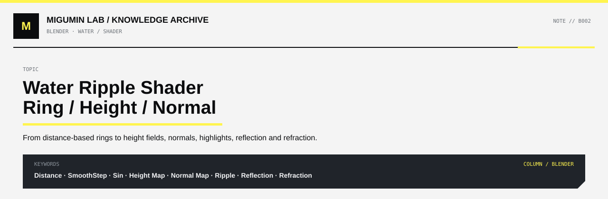
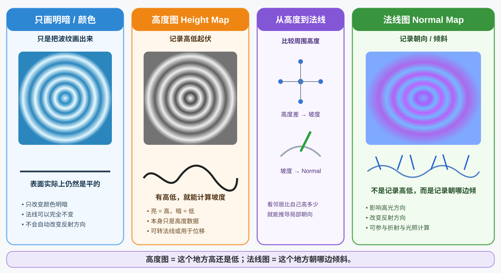

<p align="center">
  
</p>

<p align="center">
  <a href="../README.md#blender">← BLENDER</a> ·
  <a href="../README.md#map">KNOWLEDGE MAP</a> ·
  <a href="https://github.com/Retourflow">PROFILE</a>
</p>

---

# 水面涟漪 Shader：从圆环动画到高度图与法线图

> **学习目标**：理解游戏里水滴落下后，水面为什么会出现一圈圈向外扩散的涟漪；知道怎样用 Shader 生成这种图案，以及怎样让它影响明暗、高光、反射和折射。
>
> **适用**：Blender / Unreal Engine 5（UE5）/ 通用实时渲染。本文先讲原理，再讲可迁移到节点编辑器的思路。

---

## 先看整张图：明暗、Height Map、Normal Map 有什么不同？



**读图顺序：从左往右看。**

- **左边：只画明暗。** 把一圈圈明暗纹路画在平面上。图案虽然像水波，但材质表面的法线可以完全不变。
- **中间：高度图（Height Map）。** 灰度值存储“假设水面真的有波纹时，各位置应该有多高”。亮色表示高处、暗色表示低处，这是本文采用的约定。
- **右边：法线图（Normal Map）。** 不再记录“高多少”，而是记录“表面向哪个方向倾斜”。Shader 可以利用它计算高光、反射，以及合适材质模式下的折射。

**最重要的区别：**

> **高度图 = 这个位置高还是低。**  
> **法线图 = 这个位置朝哪个方向倾斜。**

要注意：**高度图和法线图都可以只存在于材质计算中，水面网格本身仍然完全平坦。** 只有使用顶点位移或其他真实几何变形手段时，网格才真的上下起伏。

---

## 什么是“水面上一圈圈扩散的涟漪”？

设想一滴水落在静止水面上：

- 落点是**中心**。
- 波纹先在中心出现，然后向四周扩散。
- 它看起来是圆的，因为与中心距离相同的位置会具有相似的波纹状态。
- 随着时间过去，波纹通常逐渐变弱，最后消失。

制作游戏特效时，首先不必真的模拟流体，也不必真的让水面变形。**第一步只要生成一张会动的圆环图案。**

### 圆形从哪里来？

在一张平面上，取一个中心点 `C`，再取当前正在计算的像素位置 `P`。

```text
                  P ●  当前像素
                   / 
                  /   d = 到中心的距离
                 /
                ● C   落水中心
```

计算距离：

$$
d = \operatorname{length}(P-C)
$$

如果用 UV 坐标实现，则 `P = UV`。例如中心设置为 `C = (0.5, 0.5)`。

- `d = 0`：像素就在中心。
- `d` 较小：像素靠近中心。
- `d` 较大：像素远离中心。

**距离相同的所有位置会构成一个圆。** 因此，只要 Shader 根据 `d` 来决定颜色或高度，就能生成同心圆。

> **注意**：使用 UV 时，如果物体尺寸或 UV 拉伸不均匀，图案可能从圆形变为椭圆。需要按实际比例校正坐标，或在合适情况下使用世界空间位置。

---

## 如何生成一条圆环？

先只做**一圈**，这是最容易理解的版本。

设：

- `d`：当前像素到中心的距离。
- `R`：想要画出的圆环半径。
- `w`：圆环的半宽度。

我们的判断是：**只有 `d` 接近 `R` 的像素才显示波纹。**

```text
假设 R = 0.25

中心 ---(较近区域)---[ 圆环位置 ]---(较远区域)
                       d≈R
```

最直观的中间量：

$$
delta=|d-R|
$$

`delta` 越小，说明当前像素越靠近这一圈。

若希望圆环边缘平滑，可以用：

$$
ring=1-\operatorname{smoothstep}(w_1,w_2,|d-R|)
$$

其中 `0 ≤ w₁ < w₂`。结果大致是：

- `|d-R| ≤ w₁`：圆环中心区域接近白色（1）。
- `w₁ < |d-R| < w₂`：平滑过渡。
- `|d-R| ≥ w₂`：圆环外部为黑色（0）。

这里的黑白只是**Mask 数值**，不一定是最终水面的真实颜色。

### 让圆环向外扩散

关键是：让圆环半径随时间增加。

$$
R(t)=v t
$$

- `t`：从水滴落下开始经过的时间。
- `v`：扩散速度。

那么一条动态圆环就变成：

$$
ring(t)=1-\operatorname{smoothstep}\big(w_1,w_2,|d-vt|\big)
$$

**这就是最简单的水滴涟漪动画：不是把一张圆环图片整体放大，而是让每个像素比较的目标半径不断变大。**（当然，游戏里也可以通过缩放贴图或粒子贴片实现相近效果。）

---

## 为什么有时不止一圈？`sin` 如何生成连续同心波纹？

如果水面是连续的“高—低—高—低”起伏，可以用正弦函数 `sin`：

$$
h(d,t)=\sin(kd-\omega t)
$$

- `h`：当前点的波纹高度（此处取值约为 `-1` 到 `1`）。
- `d`：与中心的距离。
- `k`：空间频率。越大，圈与圈越密。
- `ω`：时间变化频率。越大，波纹向外传播得越快。
- `t`：时间。

**为什么它会变成圆环？**

普通的 `sin(x)` 沿左右方向反复高低变化，所以像直条纹；换成 `sin(distance)` 后，相同距离的像素拥有相同的值，于是变成一圈圈同心圆。

**为什么向外移动？**

公式使用 `kd - ωt`。时间增加时，同一个波峰对应的距离也会增加。它沿半径向外移动，传播速度为：

$$
v=\frac{\omega}{k}
$$

> **单条圆环**：更适合一个明确向外扩大的边界。  
> **连续正弦波**：更适合一圈波峰、一圈波谷反复出现的波纹。

### 不要忘了衰减和出现范围

直接使用 `sin(kd-ωt)`，**整片水面都会有周期波纹**，并不自动等于“一滴水刚落下、波纹逐步出现”。

真实的短暂水滴特效通常还要限制：

1. **空间范围**：哪些位置当前有波纹？
2. **时间寿命**：水滴落下多久后应该消失？
3. **强度衰减**：越远或越晚，波纹通常越弱。

一个可理解的示例是：

$$
h(d,t)=A_0\sin(kd-\omega t)\cdot
\exp\!\left[-\left(\frac{d-vt}{\sigma}\right)^2\right]
\cdot \operatorname{saturate}\!\left(1-\frac{t}{T}\right)
$$

- 第一项 `sin(...)`：决定连续波峰、波谷。
- 第二项 `exp(...)`：让波纹主要出现在随时间向外移动的环状区域附近。
- 第三项 `saturate(...)`：让整组波纹在寿命 `T` 结束时衰减到 0。

这个公式只是**一种实用的程序化设计**，不是所有游戏都采用的唯一水波模型。初学时，先把“单圈 Mask + 半径动画”做出来即可。

---

## 三种“波纹”实现，究竟有什么区别？

### 做法一：只使用明暗或颜色

把动态圆环的数值直接混入水面颜色：

```text
圆环 Mask
    ↓
颜色混合（深蓝 ↔ 浅蓝）
    ↓
水面 Base Color / 自发光等外观通道
```

例如 `ring = 1` 时显示浅色，`ring = 0` 时显示深色。

**视觉效果**：俯视时有明显的一圈圈纹路，但这些环不一定能根据光源方向产生正确的高光与反射变化。

**本质**：是在一个表面上**画出**波纹。

适合：2D 特效、卡通水面、UI、简单风格化游戏效果。

> 这种方式并不意味着材质不能受光。它仍然可以使用正常的光照材质；只是**圆环本身没有改变表面法线**，因此没有由波纹坡度驱动的高光变化。

### 做法二：把波纹作为高度图 Height Map

刚才用 `sin` 或距离 Mask 得到的数值，可以改成**高度**的含义：

| 高度图亮度 | 表示什么 | 剖面理解 |
|---|---|---|
| 白色 / 高数值 | 相对高处 | 波峰 |
| 中灰 / 中间值 | 参考高度 | 平均水面附近 |
| 黑色 / 低数值 | 相对低处 | 波谷 |

假设从水面侧面剖开：

```text
             波峰                    波峰
              /
\                    /\
平均水面 -----/----\----------------/--\------
            /      \      波谷    /    \
                     \______/ 
```

这张黑白图记录的是各点的**高低信息**。它仍然可以只是一张贴图或一组 Shader 数值，**不代表网格已经发生了实际形变**。

Height Map 有几个常见用途：

- 转换成法线，制造看似起伏的光照效果。
- 用于位移（如足够细分的网格的顶点位置偏移），真正改变几何高度。
- 用于特定的视差或其他高度相关材质效果。

### 做法三：把高度变化转换为法线 Normal

想象站在山坡上：

- 山顶可能比较平，法线接近竖直向上。
- 左坡向左倾斜，法线也向相应方向偏转。
- 右坡向右倾斜，法线会向另一边偏转。

**Shader 不必真的把平面抬成山坡，只要告诉光照系统“这里的表面朝哪边倾斜”，就能制造很多相似的高光和反射变化。**

这就是波纹法线图在做的事情。

#### 高度怎样变成法线？

取当前位置的高度，再看附近的高度：

```text
                       h(x, y+Δy)
                            ●
                            │
      h(x-Δx, y) ●───●───● h(x+Δx, y)
                       当前点
                            │
                            ●
                       h(x, y-Δy)
```

比较左右高度差，得出左右方向坡度；比较上下高度差，得出上下方向坡度。

例如：

$$
h_x\approx\frac{h(x+\Delta x,y)-h(x-\Delta x,y)}{2\Delta x}
$$

$$
h_y\approx\frac{h(x,y+\Delta y)-h(x,y-\Delta y)}{2\Delta y}
$$

如果局部平面使用 `x、y` 作为水面方向、`z` 作为竖直方向，那么法线可近似构造为：

$$
\mathbf N=\operatorname{normalize}(-s h_x,-s h_y,1)
$$

`s` 控制凹凸强度。上式得到的是**局部坐标系的法线**；真正接入 UE5 等引擎时，需符合材质所使用的切线空间或世界空间约定。

别被公式吓到，只需要记住：

> **看邻居比自己高多少 → 得到坡度 → 得到表面朝向（Normal）。**

把 Normal 用在支持相应光照计算的水材质里，便能影响：

- **高光（Specular Highlight）**：波峰两侧会随光源与视角出现不同亮度。
- **反射（Reflection）**：反射方向随局部法线变化。
- **折射（Refraction）**：如果采用支持折射的材质路径，可以让水下背景看起来扭曲。

**限制**：Normal 只是改变“光照认为表面朝向哪里”，不会自动改变水面的真实轮廓，也不会自动产生波浪撞击物体的真实物理效果。

---

## 三种结果，放在一起比较

| 对比 | 只改变颜色 | 高度图 | 法线图 |
|---|---|---|---|
| 存储内容 | 明暗/颜色值 | 相对高度 | 表面方向 |
| 一圈圈波纹 | 可以 | 可以 | 可以 |
| 默认直接改变几何形状 | 否 | 否 | 否 |
| 可以用于动态光照相关计算 | 作为颜色参与 | 可先转换或用于其他高度算法 | 是，直接影响法线相关计算 |
| 适合的效果 | 风格化画出来的水纹 | 波峰波谷的数据来源 | 高光、反射与特定折射效果 |

**容易混淆的一点**：高度图和法线图并不是必须二选一。

完整流程常常是：

```text
中心 C + 像素位置 UV + Time
              ↓
         Distance 距离
              ↓
    圆环 Mask / 正弦波 sin
              ↓
           高度 h
           ↙   ↘
  混入颜色       根据高度差求坡度
                    ↓
                  Normal
                    ↓
         高光 / 反射 / 折射
```

如果需要真实几何起伏，也可以从 `h` 另开一路进行顶点位移（需要网格和渲染管线支持）。

---

## 放到 UE5 里：最适合新手做的第一个实验

**目标**：在平面上制作“水滴落下，一圈亮环向外扩散并逐渐消失”的效果。先不加入真正的水体折射。

### 第一步：生成与中心的距离

```text
TextureCoordinate (UV)
           │
           ▼
Subtract ◄──── Vector2 (Center = 0.5, 0.5)
           │
           ▼
        Length
           │
           ▼
       Distance (d)
```

### 第二步：让目标半径变大

```text
Time（持续计时，或事件触发后的年龄 age）
           │
       Multiply ◄──── Speed
           │
           ▼
        Radius R
```

### 第三步：只留下接近半径 R 的区域

```text
Distance ──┐
           Subtract → Abs → SmoothStep → OneMinus → Ring Mask
Radius ────┘
```

这里的 SmoothStep 用较小和较大的阈值控制圆环厚度与柔和边缘。

### 第四步：显示在材质上

```text
深水色 ────────┐
              Lerp（Ring Mask） → Base Color / Emissive Color
浅色波纹 ──────┘
```

然后额外乘上一个随**水滴年龄**下降的 `Fade`，就能让这次波纹结束。

> **特别提醒**：UE5 的 `Time` 本身通常是持续增长的全局时间。单独连接 Time 可以看到持续扩散的图案，但**不能自动实现“每次水滴落下都从零开始”**。真正交互式的水滴，需要有事件开始时间、每个涟漪的年龄参数、粒子生命周期或其他重置机制。

### 第五步：升级成有“水面感”的波纹

已经能显示圆环之后：

1. 把 `Ring Mask` 升级为具有波峰波谷的高度数据，例如移动的 `sin` 波形。
2. 根据高度变化计算法线（可用合适的高度转法线材质函数，或自行对附近高度采样）。
3. 把得到的法线以正确坐标空间传入材质 `Normal`。
4. 观察在不同光照与相机角度下，高光和反射是否随涟漪变化。
5. 最后才尝试 UE5 对应材质模式下的折射功能。

**不要一开始就同时做圆环、反射、折射和几何位移。** 分步验证，才能知道每一步究竟改变了什么。

---

## 跟其他常见水体 Shader 技术有什么关系？

### 滚动 Normal Map（Panner）与圆形涟漪

它们不是同一件事。

- **滚动 Normal Map**：移动一张已有的法线纹理，适合持续流动的细碎水面波纹。
- **圆形涟漪**：围绕具体落水中心，生成并扩大同心圆，适合雨滴、角色踩水、物体入水。

它们可以叠加：一张长期流动的水面 Normal，加上局部生成的动态圆环 Normal。

### 地面水坑必须有真实水体吗？

**不一定。** 如果只是地面浅水坑的涟漪，可以使用地表材质：

- `Wetness Mask` 让地面显得湿润（如适当降低 Roughness、调整 Base Color）。
- `Puddle Mask` 决定哪里有积水，并在这些位置减弱原始地面细碎法线的影响。
- `Ripple Mask / Ripple Normal` 只在水坑范围内制造涟漪。

这样即使没有额外的真实水网格，也可以出现有说服力的浅水涟漪；但它不等于完整模拟深水、折射或流体体积。

### 那什么时候需要顶点位移？

如果水浪要明显改变轮廓，例如大浪、从侧面看到的水面隆起，单纯 Normal 通常不够。此时需要几何变化，例如顶点位移；具体性能和适用性取决于网格密度及引擎方案。

---

## 容易出现的误解

**误解：一圈圈波纹一定是 Normal Map 做出来的。**  
不一定。可以是颜色 Mask、程序化高度、法线纹理、顶点位移、粒子贴片，或它们的组合。

**误解：有 Height Map，水面就真的凹凸不平了。**  
不对。Height Map 首先只是描述高度的数值。是否改变几何由后续怎样使用它决定。

**误解：Normal Map 里面蓝紫色越亮就代表越高。**  
不对。典型法线图的 RGB 通道编码的是方向分量，不是单纯的高度值。不要按高度图的黑白逻辑解读 Normal Map。

**误解：只要接了 Normal，背景就一定会被扭曲。**  
不对。Normal 可改变光照和反射结果，但背景折射要依赖具体材质模型与渲染路径。

**误解：`sin(distance - time)` 就是完整雨滴特效。**  
不对。它能形成移动的同心波纹，但若没有空间和时间限制，波纹往往会在整个表面一直存在。

---

## 快速自测

**Q：为什么 `distance(UV, Center)` 能生成圆形？**  
A：因为到固定中心距离相同的点组成圆，Shader 可以让这些点得到相同数值。

**Q：我只想让平面上出现明暗交替的圆环，需要 Height → Normal 吗？**  
A：不需要。直接把圆环 Mask 混入颜色就行。

**Q：想让水面的波纹改变高光，应该重点修改什么？**  
A：局部法线 Normal。可以先生成波纹高度，再依据附近高度差计算坡度和法线。

**Q：Normal Map 已经变了，水面侧面轮廓就会一起起伏吗？**  
A：不会。单纯 Normal Mapping 不能改变真实轮廓。

---

## 最后用四句话记住

1. **Distance 决定圆形**：以落点为中心，计算每个像素离中心多远。
2. **Time 决定动画**：让圆环半径增大，或改变正弦波相位。
3. **Height 决定高低**：记录想要的波峰、波谷，不一定真的改变网格。
4. **Normal 决定朝向**：从高度变化推导局部斜率，再影响高光、反射与适用情况下的折射。

**推荐练习顺序：单圈明暗 → 多圈正弦波 → 时间衰减 → 高度转法线 → 与水材质结合。**