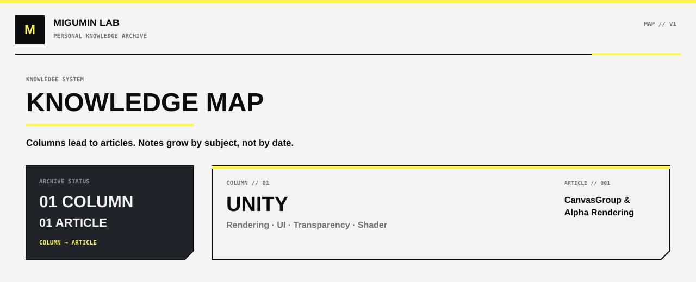

<p align="center">
  
</p>

<p align="center">
  <a href="https://github.com/Retourflow"><b>PROFILE</b></a> ·
  <a href="#map"><b>MAP</b></a> ·
  <a href="#unity"><b>UNITY</b></a>
</p>

> **Core:** document what I actually learn and understand.  
> This repository is organized as **column → article**, not as a daily study diary.

<a id="map"></a>

## Map

| Column | Area | Articles |
| --- | --- | ---: |
| [UNITY](#unity) | Rendering / UI / NPR | 2 |

---

<a id="unity"></a>

## UNITY

### Rendering / UI

- [CanvasGroup 与透明渲染](./Unity/CanvasGroup-Alpha-Rendering.md)  
  `CanvasGroup` · `Alpha Blending` · `Render Order` · `RenderTexture` · `Transparency Sorting` · `Spine` · `Live2D` · `Dissolve` · `Dither Fade`

- [《终末地》3 渲 2 角色渲染与 Shader 通俗解释](./Unity/Endfield-3D-Toon-Rendering-and-Shader.md)  
  `Toon Shading` · `Ramp` · `Face SDF` · `Tangent` · `Hair Highlight` · `Mask` · `Outline` · `Render Pass` · `Layered Material` · `Tonemapping`

---

### Repository structure

```text
MIGUMIN-Lab/
├── README.md
├── assets/
└── Unity/
    ├── CanvasGroup-Alpha-Rendering.md
    └── Endfield-3D-Toon-Rendering-and-Shader.md
```

New columns are added only when there is real study content to place inside them.
