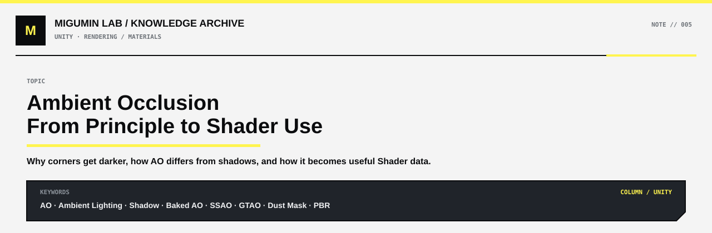

<p align="center">
  
</p>

<p align="center">
  <a href="../README.md#unity">← UNITY</a> ·
  <a href="../README.md#map">KNOWLEDGE MAP</a> ·
  <a href="https://github.com/Retourflow">PROFILE</a>
</p>

---

# AO：从“角落为什么会变暗”到 Shader 里的实际用法

AO 的全称是 **Ambient Occlusion，环境光遮蔽**。

如果只看名字，它很容易被误解成“阴影”“灰尘”或者“某种做旧效果”。但 AO 本质上不是这些东西。

它真正描述的是：

> **一个位置周围有多封闭，以及这个位置能接收到多少来自环境各个方向的间接光。**

所以 AO 最核心的作用，是让模型的凹槽、接缝、角落、物体接触位置产生更自然的压暗，从而增强空间感、厚度和物体之间的接触感。

---

## 为什么墙角、缝隙和接触处会更暗

假设有一块完全暴露在外面的平面。

它周围很空，天空光、环境光可以从很多方向照进来。

```text
开放表面

      环境光
   ↘   ↓   ↙
──────────────
```

这种地方的 AO 很弱。

但如果变成一个墙角：

```text
墙面
│
│  ← 角落
│
└──────── 地面
```

角落周围被两块表面包住了。

环境光能够进入的方向明显减少：

```text
开放区域
↓
能接收到很多环境光

墙角 / 凹槽
↓
周围空间被遮挡
↓
能接收到的环境光减少
↓
视觉上更暗
```

这就是 AO 最基础的物理直觉。

所以可以先记住：

```text
开放表面
→ AO 弱

凹槽
→ AO 强

缝隙
→ AO 强

墙角
→ AO 强

物体接触处
→ AO 强
```

这里说的“AO 强”，通常意味着遮蔽程度更高，最终环境光贡献更低。

---

## AO 不是普通阴影

AO 和 Shadow 很容易混在一起，因为它们都会让画面变暗。

但它们判断“为什么这里应该暗”的方式完全不同。

普通阴影关注的是：

```text
Light
↓
中间有没有物体挡住
↓
有
↓
产生 Shadow
```

例如太阳照到建筑，建筑后面出现投影。

这是典型的直射光阴影。

AO 关注的不是某一盏灯，而是：

```text
这个点周围的空间有多开放？
↓
环境光能从多少方向进入？
↓
越封闭
↓
环境光越少
↓
AO 越明显
```

所以即使一个地方仍然能够被太阳照到，它也可能同时存在 AO。

例如一个结构内部的角落：

```text
太阳光
↘

│\
│ \
│  \

```

太阳可能仍然照得到这里。

但因为周围几何结构很多，来自天空和环境的间接光不容易进入，于是这里依然会有 AO。

因此：

```text
Shadow
≠
AO
```

更准确地说：

```text
Shadow
→ 某个光源被挡住

AO
→ 周围环境光被空间结构遮挡
```

两者最后会一起参与最终光照。

---

## 加上 AO 后，画面到底会发生什么

如果一个模型完全没有 AO，尤其是在比较复杂的工业场景里，很容易出现一种感觉：

> 所有零件都存在，但它们没有真正“贴”在一起。

比如一个箱子放在地上。

没有 AO：

```text
┌────────┐
│  箱子  │
└────────┘
──────────── 地面
```

如果光照比较均匀，箱子底部和地面的接触关系可能很弱。

视觉上甚至会有一点“漂浮”。

加入 AO：

```text
┌────────┐
│  箱子  │
└────────┘
▓▓▓▓▓▓▓▓▓
──────────── 地面
```

箱子和地面的接触区域会出现一层柔和的遮蔽。

这并不是说那里突然多了一块黑色贴图，而是：

> 这个位置太靠近另外一个表面，周围环境光很难进去。

因此，加 AO 以后通常会出现这些变化：

```text
接缝更明显
凹槽更深
墙角更有层次
零件之间更容易分开
物体和地面的接触更自然
复杂机械结构更容易读懂
建筑内部更有纵深
模型整体更有“重量”
```

尤其是工业场景。

大量管道、钢梁、机械零件互相穿插，如果没有足够的 AO，很多结构会在视觉上糊成一片。

AO 会帮助眼睛理解：

```text
这个管道是在墙前面

这个钢梁压在另一个结构上

这个螺丝是嵌进去的

这个箱子是真的落在地面上的

这个建筑内部比外面更封闭
```

所以 AO 的意义不仅是“变暗”。

它实际上在帮助画面表达 **空间关系**。

---

## AO 不会自动把模型变旧

AO 很容易和灰尘、污垢联系到一起，因为现实中灰尘和污垢确实经常集中在凹槽和缝隙里。

但 AO 本身不是灰尘。

也不是锈迹。

更不是“旧化”。

例如：

```text
AO
≠ Dust

AO
≠ Rust

AO
≠ Dirt

AO
≠ Weathering
```

如果一个全新的金属机器拥有 AO，它依然可以是一台非常干净的新机器。

AO 只会让：

```text
螺丝孔
接缝
凹槽
结构交界
零件接触处
```

拥有更加自然的遮蔽关系。

它不会自动让红色金属变成生锈金属，也不会自动生成灰尘纹理。

所以：

```text
干净的新模型
+
AO
=
仍然是干净的新模型
只是结构更立体
```

而不是：

```text
干净模型
+
AO
=
废弃模型
```

---

## 那为什么 AO 经常会被拿来做灰尘和污垢

虽然：

```text
AO ≠ 灰尘
```

但 AO 非常适合当作 **灰尘 Mask 的其中一个输入条件**。

因为现实里很多污垢确实容易出现在：

```text
凹槽
缝隙
墙角
结构交界
不容易被清理的位置
```

而这些位置恰好往往也是 AO 比较强的地方。

于是 Shader 可以利用 AO 去寻找这些区域。

例如：

```text
AO
↓
找到凹槽和封闭区域
```

但如果只靠 AO：

```text
所有凹槽
↓
全部均匀积灰
```

看起来会非常假。

所以通常还会加入 Noise：

```text
AO
+
Noise
↓
不规则的凹槽污垢
```

如果还想表现“灰尘更容易落在朝上的表面”，就可以再加入 World Normal：

```text
AO
+
Noise
+
Normal 朝上程度
↓
Dust Mask
```

这里三种信息分别承担不同任务。

```text
AO
→ 哪里比较凹、比较封闭

Normal
→ 哪里朝上，更容易落灰

Noise
→ 让灰尘不要均匀得像电脑生成
```

最终组合成：

```text
Dust Mask
```

然后这个 Dust Mask 才真正控制灰尘材质。

例如：

```text
Dust Mask
↓
Base Color 变灰 / 变黄
Roughness 提高
Normal 增加细小颗粒
Specular 变弱
```

完整过程可以写成：

```text
AO
+
World Normal
+
Noise
↓
生成 Dust Mask
↓
混合 Dust Material
↓
看到真正的灰尘效果
```

所以：

> AO 可以告诉 Shader “这里可能比较容易积灰”，但 AO 自己并不是灰尘。

---

## AO 本质上是一份“空间遮蔽信息”

如果暂时不考虑具体引擎，可以把 AO 理解成一张信息图。

例如一个模型的 AO Texture：

```text
白色
→ 很开放
→ 几乎没有环境遮蔽

灰色
→ 有一定遮蔽

黑色
→ 非常封闭
→ 环境光很难进入
```

于是一个复杂零件可能会得到类似：

```text
模型表面

大平面        白
结构附近      浅灰
螺丝孔        深灰
深缝隙        接近黑
```

Shader 再利用这些信息去削弱对应位置的环境光。

可以非常粗略地理解成：

```text
Ambient Lighting
×
AO
↓
最终环境光
```

当然，现代实时渲染里的实际实现会更复杂，但从理解 Shader 的角度，这个模型足够好用。

---

# AO 是“放在模型上的参数”吗

可以说：

> **AO 经常会跟着模型一起使用。**

但严格来说，AO 并不一定是“模型本身的一个参数”。

更准确的是：

> **AO 是 Shader / Material 使用的一份遮蔽数据。**

它可能来自很多不同地方。

---

## 最常见的一种：AO Texture

很多 PBR 资产都会有：

```text
Base Color
Normal
Roughness
Metallic
AO
```

其中 AO 就是一张灰度贴图。

完整关系是：

```text
3D Model
↓
UV
↓
AO Texture
↓
Material
↓
Shader
↓
最终渲染
```

这里的 AO Texture 和模型 UV 一一对应。

也就是说：

```text
模型上的这个点
↓
通过 UV
↓
找到 AO Texture 的这个像素
↓
得到对应 AO 数值
```

这种情况下，我们口语上完全可以说：

> “这个模型有 AO。”

但实际上真正存在的是：

```text
模型
+
UV
+
AO Texture
```

而不是模型里面有一个统一的：

```text
AO = 0.7
```

因为同一个模型不同位置的 AO 完全不同。

例如：

```text
大平面      AO 很弱
浅凹槽      AO 中等
深缝隙      AO 很强
```

---

## Baked AO：把模型自己的遮蔽提前算好

AO 很常见的一种来源叫：

**Baked AO**

也就是提前烘焙。

流程大概是：

```text
高模 / 低模 / 场景几何
↓
计算每个位置周围有多少遮挡
↓
烘焙成 AO Texture
↓
游戏运行时直接读取
```

例如模型上有一个很深的机械凹槽。

它的几何结构基本不会变化。

那么没有必要每一帧都重新计算。

可以提前算好：

```text
这里很开放
→ 白

这里稍微有遮挡
→ 灰

这里是深缝隙
→ 黑
```

然后存进 Texture。

这种 AO 是非常典型的：

> **模型自身结构造成的 AO。**

---

## Vertex AO：AO 甚至可以存在模型顶点里

AO 也不一定非要用贴图。

有时候可以把 AO 存在：

```text
Vertex Color
```

或者其他 Vertex Attribute 里面。

例如：

```text
Mesh Vertex
↓
每个 Vertex 存一个 AO 数值
↓
Shader 读取
↓
在三角形内部插值
```

这种方法不需要额外的 AO Texture。

但精度会受到模型顶点密度影响。

模型顶点越少：

```text
AO 精度越低
```

顶点越多：

```text
AO 可以表现得越细
```

所以更适合比较低频、大范围的遮蔽信息。

---

# AO 也可以完全不是模型自带的

这就是实时 AO。

最典型的就是：

```text
SSAO
Screen Space Ambient Occlusion
```

以及更高级一些的：

```text
GTAO
Ground Truth Ambient Occlusion
```

这种 AO 不是模型提前烘焙好的。

而是游戏每一帧根据当前画面实时计算。

---

## 为什么需要实时 AO

假设有两个完全独立的箱子。

```text
箱子 A        箱子 B
```

它们原本相距很远。

那么各自烘焙 AO 的时候，它们根本不知道另一个箱子的存在。

现在游戏里把它们移到一起：

```text
箱子 A  箱子 B
      ↑
    很窄的缝
```

理论上这个缝隙应该比较暗。

但：

```text
箱子 A 的 AO Texture
不知道箱子 B 在这里

箱子 B 的 AO Texture
也不知道箱子 A 在这里
```

所以单靠 Baked AO 无法解决。

这时候实时 AO 就可以通过当前的 Depth、Normal 等画面信息发现：

```text
这个像素附近
有很多非常靠近的表面
↓
空间比较封闭
↓
AO 增强
```

于是两个原本毫无关系的模型，一旦靠近，就可以自动产生接触遮蔽。

这对于游戏非常重要。

因为游戏里的：

```text
角色
箱子
车辆
门
动态机关
碎石
NPC
可移动物体
```

都可能随时改变位置。

---

# 模型 AO 和实时 AO 可以同时存在

实际游戏里并不是：

```text
Baked AO
或者
SSAO
```

二选一。

很多项目会同时使用：

```text
模型自身 AO
+
实时环境 AO
↓
最终 AO
```

它们负责不同尺度的问题。

模型自身的 AO 更擅长：

```text
螺丝孔
模型凹槽
钢板接缝
机械细节
自身结构
```

实时 AO 更擅长：

```text
箱子和地面的接触
角色脚和地面
两个动态物体靠近
碎石与地面
建筑和临时摆件
```

所以一栋工业建筑可能同时存在：

```text
建筑自己的 Baked AO
↓
表现钢梁、凹槽、结构内部

SSAO / GTAO
↓
表现建筑与管道、碎石、地面之间的接触
```

两者叠加后，场景的空间关系会稳定很多。

---

# 回到工业场景里，AO 实际在做什么

像《终末地》这种大量机械、建筑和废墟组成的工业场景，AO 会特别重要。

因为画面里充满：

```text
钢梁
管线
楼梯
平台
墙体
机械结构
碎石
箱体
支架
```

如果这些东西只有 Base Color、Roughness、Normal 和普通光照，很多结构很容易混在一起。

加入 AO 后：

```text
管道和墙的连接位置
↓
更容易看出接触

楼梯和建筑主体
↓
层次更明确

钢梁互相交叉
↓
不会像两个颜色块直接穿在一起

碎石压在地面上
↓
更有重量

建筑内部结构
↓
更有纵深

机械凹槽
↓
更容易被视觉读取
```

AO 在这里做的事情并不华丽。

它不会让玩家第一眼说：

> “这里 AO 真厉害。”

但如果把 AO 拿掉，很多人马上会感觉：

> “怎么突然有点平？”

这就是 AO 的特点。

它往往不是视觉主体，但会默默支撑整个场景的空间感。

---

# AO、Normal、Roughness、Base Color 各自在干什么

这几个东西很容易在刚开始学材质的时候混到一起。

可以把它们放在同一个物体上理解。

假设是一块旧金属板。

### Base Color

回答：

> 它本身是什么颜色？

```text
红色油漆
灰色金属
黄色警示条
```

---

### Normal

回答：

> 表面的小凹凸朝哪个方向？

它可以让一个实际上很平的表面看起来有：

```text
划痕
颗粒
锤击痕迹
小凹坑
```

---

### Roughness

回答：

> 这个表面的反射有多散？

```text
低 Roughness
→ 光滑
→ 高光集中

高 Roughness
→ 粗糙
→ 高光扩散
```

---

### Metallic

回答：

> 这个表面是不是金属，以及按照金属方式反光。

---

### AO

回答：

> 这里周围是不是比较封闭，环境光是不是不容易进入。

所以：

```text
Base Color
→ 颜色

Normal
→ 微观凹凸方向

Roughness
→ 表面反射粗糙程度

Metallic
→ 金属属性

AO
→ 环境遮蔽程度
```

它们互相配合，但职责并不相同。

---

# AO 与灰尘 Shader 的真正关系

把整个关系串起来，就会非常清楚。

AO 最开始只是：

```text
空间遮蔽信息
```

但 Shader 可以拿它做更多事情。

例如我们想做工业场景中的积灰。

首先：

```text
AO
↓
寻找凹槽
```

然后：

```text
World Normal
↓
寻找朝上的表面
```

再加入：

```text
Noise
↓
制造自然的不规则分布
```

最后：

```text
AO
+
World Normal
+
Noise
↓