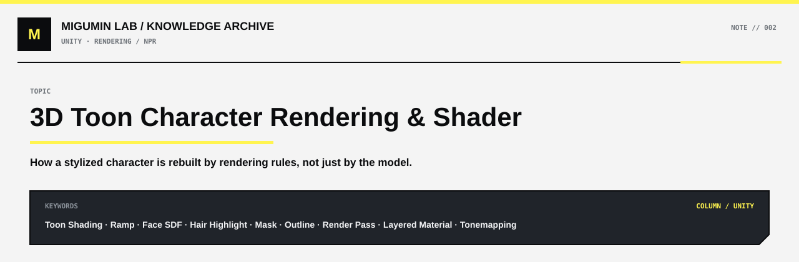

<p align="center">
  
</p>

<p align="center">
  <a href="../README.md#unity">← UNITY</a> ·
  <a href="../README.md#map">KNOWLEDGE MAP</a> ·
  <a href="https://github.com/Retourflow">PROFILE</a>
</p>

---

很多人第一次看《终末地》这类 3 渲 2 游戏角色时，会下意识觉得：

> 这不就是一个做得很漂亮的 3D 模型吗？

其实远远不止。

一个角色最终出现在屏幕上，并不是“模型放进引擎里，然后自动变成二次元”。更接近真实情况的理解是：

> **先有一个普通 3D 模型，再给它一层一层套上“怎么画才好看”的规则。**

这些规则会决定：哪里亮、哪里暗，脸上的阴影怎么走，头发高光长什么样，哪些地方像金属，哪些地方像布料，轮廓线怎么出现，刘海挡住眉毛时要不要“作弊”，最后整个画面还要不要再统一调色。

如果一定要把整个过程压成一句话，可以这样记：

> **模型负责形状，贴图负责提供信息，Shader 决定怎么画，Render Pass 决定先画什么后画什么，最后再通过后处理统一画面。**

大概是这样：

```text
3D 模型
  ↓
基础颜色
  ↓
判断哪里亮、哪里暗
  ↓
把真实渐变改成二次元色块
  ↓
脸使用专门的阴影规则
  ↓
头发使用专门的高光规则
  ↓
衣服 / 金属 / 皮肤分别处理
  ↓
描边
  ↓
眉毛、头发遮挡等特殊处理
  ↓
角色阴影
  ↓
Tonemapping / Color Grading / Bloom
  ↓
最终画面
```

---

## 一、先别急着想 Shader：最底下其实只是一个普通 3D 模型

比如一个角色的头。

模型本身最开始只负责告诉显卡这些东西：

- 这里有一个鼻子
- 这里有一撮头发
- 这个面的朝向是哪里
- 这根头发大概沿哪个方向延伸
- 这块表面对应贴图上的哪个位置

也就是一些最基础的数据：

```text
Position      位置
Normal        法线
Tangent       切线
UV            贴图坐标
Vertex Color  顶点色
```

这时角色还没有“二次元味”。

它只是一个带有几何形状和基础数据的 3D 模型。

真正决定它最后“长什么样”的，是后面那一整套渲染规则。

---

## 二、Shader 到底是什么？

这是最容易被绕晕的地方。

最简单的理解：

> **Shader 就是一段告诉 GPU“这个东西最后应该怎么画”的程序。**

它不是贴图，也不是模型，更不是材质本身。

可以把它理解成“规则”。

比如一件红色衣服。

贴图告诉 Shader：

> 这里原本是红色。

然后 Shader 再判断：

> 这个地方是不是朝着光？  
> 这里该不该有高光？  
> 这里是不是在阴影里？  
> 这个地方是不是金属？  
> 这里有没有被雪覆盖？  
> 这个地方现在是不是湿的？

最后它才决定：

> 这个像素最终应该显示成什么颜色。

所以可以把关系理解成：

```text
贴图 = 原材料
Shader = 加工规则
GPU = 执行规则的人
最终画面 = 成品
```

如果再进一步区分：

```text
Vertex Shader
→ 主要决定顶点最后放在哪里

Pixel / Fragment Shader
→ 主要决定每个像素最后是什么颜色
```

对 3 渲 2 来说，我们平时讨论的亮暗、头发高光、积雪、湿润、Face SDF，大多都和后者有关。

---

## 三、最基础的一步：先判断哪里亮、哪里暗

Shader 最先要解决的问题之一其实特别朴素：

> **这个表面朝不朝着灯？**

假设：

```text
N = 表面方向
L = 光线方向
```

Shader 会做一个类似：

```text
N · L
```

的计算。

先不用管公式。

你只需要理解结果：

```text
面朝着光 → 数值大 → 更亮
侧着光   → 数值居中
背着光   → 数值小 → 更暗
```

现实光照往往是平滑过渡的：

```text
亮
████▓▓▒▒░░░░
暗
```

但二次元游戏通常不想要这么真实。

于是 Shader 会说：

> 不要这么连续，把中间砍掉。

最后可能变成：

```text
████████ | ░░░░░░░░
   亮面        暗面
```

这就是最基础的 **Toon Shading**。

所以 3 渲 2 一个非常核心的思想就是：

> **先计算真实光照，再把结果重新解释成二次元的规则。**

也就是说，3 渲 2 并不是完全不要物理规律。

恰恰相反，它经常先用物理规律算出一个基础结果，然后再故意“破坏”它，让画面更符合美术设计。

---

## 四、Ramp：不是“有多亮”，而是“这个亮度应该长什么颜色”

普通光照可能会告诉 Shader：

```text
这里亮度 = 0.63
```

如果是很直接的真实渲染，它可能就根据 0.63 去变亮或者变暗。

但二次元 Shader 不一定这么做。

它可以拿这个 0.63 去查一张专门的颜色表。

例如：

```text
暗紫 → 暖棕 → 肤色 → 亮肤色
```

于是 Shader 会得到一个更美术化的结果：

> 0.63 在这个游戏里，不是简单的 63% 亮，而应该对应这一种颜色。

这类东西就常被叫做 **Ramp**。

所以同样一个阴影区域：

普通游戏可能只是：

> 变暗。

而 3 渲 2 游戏可以规定：

> 阴影稍微偏紫。  
> 亮部稍微偏暖。  
> 中间不要出现脏灰。  
> 某一段亮度直接跳到另一种色调。

这就是为什么很多商业 3 渲 2 游戏的阴影颜色看起来特别“干净”。

它不是单纯把真实光照压暗。

而是：

> **重新指定“这个亮度应该是什么颜色”。**

---

## 五、为什么脸不能和普通物体一样照？

如果你直接拿普通光照去照一张二次元脸，结果往往会很难看。

因为真实光照会很认真地告诉你：

```text
鼻子下面应该黑
眼窝应该有阴影
嘴角旁边也应该暗
```

现实里这没问题。

但二次元脸一旦阴影太真实，往往就会显得脏、老、凹凸太重。

所以很多 3 渲 2 游戏会对脸单独处理。

其中一个常见思路就是：

> **Face SDF**

你可以先把它理解成一张“脸部阴影指导图”。

它大致是在告诉 Shader：

> 光从这个方向来的时候，阴影最好沿这里走。  
> 光转到另一边时，阴影应该怎么移动。

于是：

```text
光从左边
→ 左右脸阴影按设计好的方式移动

光转到正面
→ 阴影慢慢退掉

光从右边
→ 阴影再切换到另一边
```

这时你看到的阴影已经不是完全按照“物理正确”来算。

而是：

> **为了让角色脸更像二次元、更好看，提前设计出来的阴影行为。**

这就是 NPR——Non-Photorealistic Rendering——非常核心的思想：

> **不是追求最真实，而是追求最好看。**

---

## 六、为什么头发的高光和普通物体不一样？

普通物体的高光经常是一个比较集中、接近圆形的亮点。

大概像：

```text
      ●
```

但你去看很多 3 渲 2 游戏的头发，高光往往会沿着发丝方向拉成长条：

```text
════════════
```

这时 Shader 就不能只看表面法线了。

它还要知道：

> **头发往哪个方向长？**

这时候就会用到：

```text
Tangent
```

也就是切线。

你可以把它理解成：

> 表面上“沿着头发方向”的那条线。

然后像 Kajiya–Kay 这类头发高光模型，会利用：

```text
Tangent
Light Direction
View Direction
```

去计算一条顺着头发方向移动的高光。

很多时候还不是只做一层。

而是：

```text
一层宽、弱、柔和的高光
+
一层窄、强、明显的高光
```

例如：

```text
柔和高光
░░░░░░░░░░░░░░░

主高光
     ███████
```

最后叠起来：

```text
░░░░███████░░░░
```

这样头发就不会像塑料，而是会出现更丰富的层次。

所以很多高级材质的一个通用思想就是：

> **高光不一定只有一层。**

头发只是一个很典型的例子。

---

## 七、同一个角色身上，其实有很多“材质规则”

一个角色并不是“整个人共用同一种材质反应”。

皮肤、金属、布料、头发，它们对光的反应完全不一样。

比如：

```text
皮肤
→ 高光柔和

布料
→ 粗糙，反光弱

金属
→ 高光明显，反射更强

头发
→ 使用各向异性高光
```

所以 Shader 需要知道：

> 这块地方到底是什么材质？

这时就会用到很多 **Mask**。

Mask 可以先简单理解成“区域说明图”。

比如：

```text
R 通道 → 皮肤区域
G 通道 → 金属区域
B 通道 → 高光区域
A 通道 → 其他特殊区域
```

于是 Shader 看到：

> 这里是金属。

就用金属规则。

看到：

> 这里是布料。

就改用布料规则。

所以一个角色表面看起来只有一套贴图，实际上背后可能藏着大量 Mask 在告诉 Shader：

> **这里是什么东西，以及这里应该怎么画。**

---

## 八、描边是怎么来的？

3 渲 2 最常见的特征之一，就是角色外面的轮廓线。

最经典的一种做法非常直观：

先正常画一次角色。

然后再画一次“稍微膨胀一点的角色”。

第二次绘制时：

```text
模型稍微往外撑
+
只显示背面
+
整个涂成深色
```

于是就变成：

```text
深色的大模型
  +
正常的小模型
```

大模型露出来的那一圈边缘，就是 Outline。

这就是常说的 **Inverted Hull Outline** 思路之一。

当然，商业游戏里可能会用屏幕空间描边、法线描边、混合式描边，甚至不同部位不同规则。

但最重要的是先理解：

> **描边往往也不是“模型自带的黑边”，而是渲染规则额外画出来的。**

---

## 九、3 渲 2 里有大量“故意作弊”

二次元渲染有一个很有意思的特点：

它经常会主动违反现实。

比如刘海挡住眉毛。

现实世界的逻辑：

> 挡住了，那就看不到。

但二次元角色如果完全看不到眉毛，表情可能会变得很弱。

于是渲染系统可能会做特殊处理：

```text
先正常画头发
↓
再单独把眉毛画一次
↓
控制它透过头发的程度
```

于是你会看到：

> 眉毛隐约穿过刘海。

物理上不真实。

但视觉上更好看。

这正是 3 渲 2 的核心：

> **利用 3D 的便利，但在关键地方主动让它像 2D。**

类似的“作弊”还有很多：

```text
脸部阴影不按真实结构走
头发高光人为加强
描边现实中不存在
眉毛可以透过头发
某些部位永远保持合适亮度
不同材质使用夸张的颜色响应
```

这些东西不是错误。

恰恰是风格的一部分。

---

## 十、雨水和积雪，其实也是同一套思路

很多人会问：

> 角色进入雪地以后，是不是提前做了一张“雪地版贴图”？

不一定。

更常见的思路是：

> **角色的 Shader 本来就支持“湿润”和“积雪”这类额外效果。**

### 雨水 / 湿润

角色原来是：

```text
干燥材质
```

进入雨天以后，Shader 可能改变：

```text
颜色稍微变深
Roughness 降低
Specular 增强
加入水滴 Normal
```

于是：

```text
原材质
+
湿润效果
=
淋湿后的外观
```

注意，这时候并不一定真的“盖了一张雨水贴图”。

很多时候只是：

> **原本的材质参数发生了变化。**

### 积雪

积雪更像：

```text
原材质
+
雪材质层
```

然后 Shader 会判断：

> 哪些地方容易积雪？

最简单的方式就是看：

```text
这个表面是不是朝上？
```

所以：

```text
头顶
→ 容易积雪

肩膀
→ 容易积雪

下巴下面
→ 很少积雪

衣服底面
→ 基本没有
```

最终：

```text
原来的颜色
+
雪的颜色
+
雪的 Roughness
+
雪的 Normal
+
Snow Mask
=
积雪后的表面
```

所以更准确的说法不是：

> 给角色换了一套雪地贴图。

而是：

> **Shader 在原材质上混入一层“雪材质效果”。**

这类思路也叫：

> **Layered Material / Material Blending**

也就是“材质分层”和“材质混合”。

---

## 十一、最后还要做一次“全画面后期”

即使前面的 Shader 全部写完，画面也不一定马上有商业游戏的质感。

因为最终还会经过：

```text
Tonemapping
Color Grading
Bloom
Exposure
Fog
环境颜色
```

这一步很像 AE 里的：

> 调色 + 后期。

同一个角色 Shader：

```text
没有后处理
```

可能会像：

> Unity 二次元 Demo。

但如果加上：

```text
正确曝光
合适的颜色曲线
Tonemapping
环境光
Bloom
雾效
```

整体气质就可能完全变化。

所以商业游戏画面好看，从来不只是：

> Shader 写得好。

而是整条链路都在一起工作。

---

## 十二、最后再看一次整个角色，你会发现它已经不是“一个模型”

一个《终末地》风格的角色，真正可以理解成：

```text
3D 模型
+
基础贴图
+
Normal / Tangent / UV
+
大量 Mask
+
Toon 光照
+
Ramp
+
Face SDF
+
头发各向异性高光
+
不同材质规则
+
描边
+
特殊 Render Pass
+
阴影
+
雨水 / 积雪等环境效果
+
Tonemapping / Color Grading
```

最后才变成你屏幕上看到的那个角色。

所以以后再看 3 渲 2 角色时，可以试着不要只问：

> 这个模型做得好不好？

而是多问几句：

> 为什么这里的阴影这么干净？  
> 为什么头发高光是横着的一条？  
> 为什么脸上的阴影没有按真实结构走？  
> 为什么眉毛能透过刘海？  
> 为什么角色进雪地以后只有朝上的地方积雪？  
> 为什么同一个模型换个 Tonemapping 就像换了一个游戏？

当你开始这样看画面时，你其实已经不只是“看角色”了。

你开始在看：

> **它背后的渲染规则。**

这也是 Rendering TA 看画面时最有意思的地方。

---

## 一句话总结

如果一定要把全文压缩成一句：

> **3 渲 2不是让 3D 模型变成 2D，而是让 GPU 按照一整套“二次元美术规则”重新解释这个 3D 模型。**

而 Shader，就是这套规则里最重要的执行者之一。
