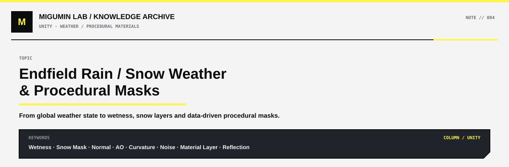

<p align="center">
  
</p>

<p align="center">
  <a href="../README.md#unity">← UNITY</a> ·
  <a href="../README.md#map">KNOWLEDGE MAP</a> ·
  <a href="https://github.com/Retourflow">PROFILE</a>
</p>

---

# 《终末地》雨雪天气与程序化 Mask：从天气系统到材质响应的完整逻辑

《明日方舟：终末地》这类实时游戏里的天气效果，不能简单理解成“下雨就加雨滴、下雪就加雪花”。真正完整的天气系统，通常会同时影响角色材质、地面、建筑、雾、天空、风、反射以及后期画面。

所以更合理的理解方式是：

> **天气系统负责告诉场景“现在是什么天气、强度是多少”，Shader 再决定不同物体应该怎样响应这个天气。**

例如：

```text
RainAmount = 0 ~ 1
SnowAmount = 0 ~ 1
Wetness = 0 ~ 1
```

这些参数本身并不会直接画出雨和雪，它们只是全局状态。

真正的视觉结果，是角色、地面、建筑等各自的 Shader 读取这些参数以后产生的。

---

## 天气首先是一个全局状态，而不是单独特效

可以把整个天气系统理解成：

```text
天气系统
Rain / Snow / Wind / Fog
        ↓
全局参数
RainAmount / SnowAmount / Wetness
        ↓
角色 Shader
地面 Shader
建筑 Shader
粒子系统
环境光照
后期
        ↓
最终天气画面
```

因此同一个“下雪”状态，可以同时驱动：

- 天空变冷
- 雾增强
- 雪花粒子出现
- 地面积雪增加
- 角色肩膀和头顶开始积雪
- 建筑顶部出现雪层
- 后期色调偏冷

这也解释了为什么天气不一定必须按地图大区整块切换。

更合理的做法是：

```text
Region Weather Profile
+
Local Weather / Climate Volume
↓
局部天气结果
```

例如靠近雪山以后：

```text
离雪山较远
→ 无雪 / 少雪

逐渐靠近雪山
→ 雪粒子增加
→ 雾更冷
→ 地面积雪增强
→ 角色积雪增强

进入核心雪区
→ 完整雪天气效果
```

这样天气会自然渐变，而不是跨过一条地图边界就瞬间切换。

---

## 角色通常不是换一整套“雨天材质”或“雪天材质”

实时游戏里更常见的方式，是保留角色原始材质，然后在上面额外叠加天气层。

可以理解成：

```text
原角色材质
+
Weather Layer
↓
最终角色材质
```

雨天时：

```text
原材质
+
Wet Layer
```

雪天时：

```text
原材质
+
Snow Layer
```

这样天气强度就可以连续变化，而不是在两套材质之间硬切。

例如：

```text
SnowAmount = 0
→ 没有积雪

SnowAmount = 0.3
→ 少量积雪

SnowAmount = 0.7
→ 大部分朝上区域已经覆盖

SnowAmount = 1
→ 完整积雪状态
```

---

# 雨天材质的核心不是“雨滴”，而是 Wetness

雨天角色效果最先要解决的问题，其实是：

> **原本干燥的材质，怎样变成湿材质。**

湿润以后，常见的材质变化包括：

```text
Base Color
→ 稍微变暗

Roughness
→ 降低

Specular / Reflection
→ 增强
```

因此会出现一种很典型的现象：

> **材质底色变暗了，但表面的亮部和反射反而更明显。**

这并不矛盾。

因为湿润后：

- 本体颜色可能变深
- 表面变得更光滑
- Roughness 降低
- 镜面反射增强

所以湿布料、湿皮革、湿地面都会有“更暗但更亮”的感觉。

---

## Wetness、雨滴和流水其实是三层不同逻辑

“下雨效果”可以拆成三层：

```text
Wetness
→ 材质整体变湿

Rain Drops
→ 表面出现小水珠

Water Flow
→ 出现动态流动水痕
```

Wetness 改的是材质本身。

雨滴通常更多依赖：

```text
Rain Drop Texture / Noise
↓
Bump / Normal
↓
局部法线变化
↓
产生水滴高光
```

也就是说，模型本身不一定真的长出了一颗水珠。

Shader 只是通过 Normal 或 Bump，让光照看起来像那里有一个水滴。

流水则通常还需要：

```text
Flow Map
UV Animation
World Position
Noise
Time
```

让水纹沿特定方向移动。

所以：

> **湿润、雨滴、流水虽然都属于雨天效果，但通常不是同一个计算。**

---

# 不同材质的雨水响应不应该一样

布料、皮革、金属对雨水的响应明显不同。

布料可以理解成：

```text
容易吸水
→ Base Color 明显变深
→ Roughness 变化明显
```

皮革更像：

```text
不一定大量吸水
→ 更偏向表面湿亮
→ 高光和反射增强
```

金属则更接近：

```text
几乎不存在“吸水变暗”
→ 更偏水膜和反射变化
```

所以 Shader 必须知道：

> **这个区域应该受到多少 Wetness 影响。**

---

## 一个很通用的做法：用 Roughness 和 Metallic 去估算材质响应

有一种非常工程化的方案，是利用角色本来就已经存在的材质参数：

```text
Roughness
+
Metallic
↓
估算材质属性
↓
计算 Permeability / Wetness Response
```

例如：

```text
高 Roughness
低 Metallic
↓
比较像布料
↓
湿润后更明显变暗
```

而：

```text
高 Metallic
↓
比较像金属
↓
主要增强水膜和反射
```

这类方法最大的优点就是：

> **不需要给每个角色、每件衣服都额外画一张湿润 Mask。**

全局脚本只需要统一控制 RainAmount / Wetness，Shader 再根据自身 Roughness 和 Metallic 自动决定响应程度。

这种设计非常适合：

- 大量角色
- 大量场景物件
- 开放世界
- 动态天气
- 自动化材质系统

---

## 但自动推断永远不够精确

Roughness 和 Metallic 描述的是光学属性，并不是真正的材质语义。

两个完全不同的材质，例如：

- 布料
- 塑料

完全可能拥有接近的：

```text
Roughness
Metallic
```

所以 Shader 只靠参数，只能“猜”。

因此更精确的做法是再加入：

```text
Wetness Mask
或
Permeability Mask
```

例如：

```text
白色
→ 强烈吸水 / 强 Wetness

灰色
→ 中等

黑色
→ 基本不受影响
```

最实用的工程组合往往是：

```text
Roughness / Metallic 自动推测
×
人工 Wetness Mask
×
全局 RainAmount
↓
最终 Wetness
```

也就是：

> **程序负责大方向，人工 Mask 负责修正。**

---

# Mask 的本质不是贴图，而是一个 0～1 权重

这是理解整个天气 Shader 的关键。

很多人一听到 Mask，就会想到黑白贴图。

但更准确地说：

> **Mask 的本质只是一个 0～1 的权重。**

例如：

```text
0
→ 完全不产生效果

0.5
→ 产生一半效果

1
→ 完全产生效果
```

所以 Mask 可以来自：

- 美术手动画的贴图
- Normal
- Roughness
- Metallic
- AO
- Curvature
- World Position
- Noise
- Vertex Color
- Material ID

只要最后得到一个 0～1 的数，就可以控制 Shader。

---

# 雪天和雨天最大的区别：雪更在意“积在哪里”

雨主要解决：

> **材质怎么湿。**

雪主要解决：

> **雪应该出现在哪里。**

因此雪通常会更依赖表面朝向。

可以使用：

```text
Normal · WorldUp
```

来判断一个表面有多朝上。

其中：

```text
Normal
→ 当前表面朝向

WorldUp
→ 世界向上方向
```

于是：

```text
头顶
肩膀
手臂上表面
↓
更容易积雪
```

而：

```text
下巴下面
衣服底面
身体侧面
↓
更难积雪
```

最基础的积雪逻辑就是：

```text
Normal · WorldUp
↓
Remap / Smoothstep
↓
Snow Mask
```

也就是：

```text
越朝上
→ Snow Mask 越接近 1

越朝下
→ Snow Mask 越接近 0
```

---

## Snow Mask 只决定“哪里有雪”，Snow Shader 决定“雪长什么样”

这是非常重要的区分。

Snow Mask 负责分布：

```text
这里有雪
那里没有雪
```

而真正雪的视觉表现，则来自 Snow Layer。

例如：

```text
原角色颜色
+
Snow Color

原 Roughness
+
Snow Roughness

原 Normal
+
Snow Normal
```

组合起来：

```text
原材质
+
Snow Layer
×
Snow Mask
↓
最终积雪材质
```

Snow Layer 里常见的内容包括：

- 白色 / 冷色 Base Color
- 较高 Roughness
- 雪粒 Normal
- Noise
- 微小高度变化
- 可选 Displacement

所以：

> **Mask 负责“哪里出现”，Shader 负责“出现以后长什么样”。**

---

## 为什么 Snow Mask 还要加 Noise

如果只使用：

```text
Normal · WorldUp
```

积雪边缘很容易太整齐。

例如：

```text
有雪
────────────
没雪
```

这会非常程序化。

所以通常会加入：

```text
Noise
```

形成：

```text
Normal 朝上程度
+
Noise
↓
更自然的 Snow Mask
```

这样雪线会更碎、更自然。

---

# 灰尘和雪，其实属于同一类程序化分布问题

灰尘和雪有一个共同点：

> **都更容易停留在朝上的表面。**

所以两者都可以从：

```text
Normal · WorldUp
```

开始。

这意味着雪和灰尘在 Mask 生成层面其实非常接近。

区别主要在后面的附加条件和最终材质。

---

## 灰尘为什么还会加入 AO

灰尘不只会停在顶部。

现实中它还会进入：

- 凹槽
- 缝隙
- 夹角
- 不容易被碰到的位置

AO 可以粗略帮助找到：

> **凹陷、遮挡、夹角区域。**

所以 Dust Mask 可以写成：

```text
Normal 朝上程度
+
AO
+
Noise
↓
Dust Mask
```

其中：

- Normal 负责“哪里朝上”
- AO 负责“哪里容易藏灰”
- Noise 负责让分布不规则

最终效果会比单纯使用 Normal 自然很多。

---

## 灰尘和雪真正的区别主要在最终 Shader

两者的 Mask 生成逻辑可以很像：

```text
Normal
+
Noise
```

但最终材质完全不同。

雪通常是：

```text
白色
高 Roughness
雪粒 Normal
可能有厚度
```

灰尘则更像：

```text
灰色 / 脏色
Roughness 增加
对比度下降
细小颗粒
通常没有明显厚度
```

所以：

> **雪和灰尘可以共用相似的“哪里出现”的算法，但使用完全不同的 Material Layer。**

---

# Curvature 则是在解决另一类问题：哪里容易磨损

灰尘和雪主要根据环境逻辑生成。

Curvature 更偏向模型几何逻辑。

Curvature 可以粗略理解成：

> **判断模型哪里凸、哪里凹。**

例如一个金属箱子的凸角：

```text
┌─────────┐
│         │
│         │
└─────────┘
```

这些边缘更容易：

- 碰撞
- 摩擦
- 掉漆
- 露出底层金属

所以可以：

```text
Curvature
↓
找到凸边
↓
Edge Wear Mask
```

然后：

```text
原材质
→ 黑色喷漆

Edge Wear Mask
→ 凸边区域

凸边
→ 减少黑漆
→ 露出银色金属
```

最终就会得到常见的边缘掉漆效果。

---

# 这其实是一整套非常通用的“程序化 Mask”思想

Shader 里本来就已经存在大量数据：

```text
Normal
Roughness
Metallic
AO
Curvature
World Position
Object Position
Depth
Height
Vertex Color
Noise
Material ID
```

这些都可以拿来计算 Mask。

常见流程：

```text
已有数据
↓
Step / Smoothstep / Remap
↓
Multiply / Add
↓
Clamp
↓
0 ~ 1
↓
Procedural Mask
```

于是：

```text
Normal
→ 推导朝上区域

AO
→ 推导凹槽区域

Curvature
→ 推导凸边区域

World Position
→ 推导高度和位置

Roughness + Metallic
→ 推导材质湿润响应

Noise
→ 打破过于机械的边界
```

这就是程序化材质最重要的思维之一：

> **不要一看到需要 Mask，就先想着画一张贴图。**

先问：

> **模型、场景、材质里是不是已经有数据可以推导出我要的 Mask？**

---

# 雨天地面：Wetness 和真正的倒影仍然是两回事

地面被雨打湿以后：

```text
Base Color
→ 稍微变暗

Roughness
→ 降低

Specular
→ 增强
```

这样地面会变得更有反射性。

但这里要区分：

> **Shader 决定“地面有多会反射”。**

而：

> **反射技术决定“地面实际反射到什么”。**

所以还需要：

- Reflection Probe
- Screen Space Reflection
- Planar Reflection
- Screen Space Planar Reflection

等技术。

---

## Screen Space Planar Reflection 在这套系统里的位置

可以理解成：

```text
Wet Shader
↓
让地面拥有更强的反射能力

Screen Space Planar Reflection
↓
生成角色、建筑、灯光等实际倒影
```

所以它不是 Wetness Shader 的一部分。

它们只是组合在一起以后，才形成完整雨天地面。

完整逻辑更像：

```text
RainAmount
↓
地面 Wetness 增加
↓
Base Color 略变暗
Roughness 降低
Specular 增强
↓
地面更湿、更亮
↓
Screen Space Planar Reflection
↓
出现角色、建筑、灯光倒影
↓
再叠加雨滴、流水、积水 Noise
↓
完整雨天地面
```

---

# 从《终末地》雨雪天气到通用 Shader，可以统一成同一个思路

整个系统最终可以压缩成：

```text
天气系统
Rain / Snow / Wind / Fog
        ↓
全局参数
RainAmount / SnowAmount / Wetness
        ↓
────────────────────────
        ↓
角色 Shader
        ↓
雨：
Wetness
雨滴
流水
材质差异

雪：
Normal · WorldUp
Snow Mask
Snow Layer
────────────────────────
        ↓
地面 / 建筑 Shader
        ↓
Wetness / Snow Layer
        ↓
反射 / 积水 / 积雪
────────────────────────
        ↓
环境系统
        ↓
雪花 / 雨粒子
雾
风
天空
自然光
────────────────────────
        ↓
后期
        ↓
Exposure
Tonemapping
Color Grading
Bloom
        ↓
最终天气画面
```

而其中最重要的程序化思维，就是：

```text
已有数据
↓
生成 Mask
↓
Mask 控制 Material Layer
↓
全局天气参数控制强度
```

例如：

```text
Normal
→ Snow Mask

Normal + AO + Noise
→ Dust Mask

Curvature
→ Edge Wear Mask

Roughness + Metallic
→ Wetness Response

World Position
→ Height / Water Mask
```

---

# 最后可以把整套知识压缩成几句话

> **天气系统不是一个特效，而是一组材质、粒子、环境和后期系统共同响应。**

> **雨雪角色效果通常不是替换整套材质，而是在原材质上动态叠加 Wet Layer 或 Snow Layer。**

> **雨主要解决“材质怎么湿”，雪主要解决“雪积在哪里”。**

> **Wetness、雨滴和流水通常是三套不同逻辑。**

> **Roughness + Metallic 可以自动估算雨水响应，但人工 Wetness Mask 更精确。**

> **Mask 的本质不是贴图，而是一个 0～1 权重。**

> **Normal · WorldUp 可以动态生成积雪、灰尘等朝向型 Mask。**

> **AO 可以帮助找到容易藏灰的凹槽区域。**

> **Curvature 可以帮助找到容易磨损的凸边。**

> **Noise 通常不是核心判断逻辑，而是用来打破过于规则的分布。**

> **雪和灰尘可以使用相似的 Mask 生成方式，最终区别主要在 Material Layer。**

> **地面 Wet Shader 决定有多会反射，SSR / Planar Reflection 等技术负责真正生成倒影。**

> **最通用的工程方式，是：程序化计算 + 人工修正 + 全局系统参数。**