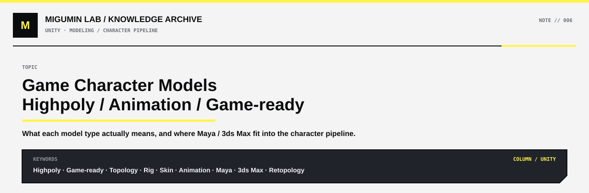

<p align="center">
  
</p>

<p align="center">
  <a href="../README.md#unity">← UNITY</a> ·
  <a href="../README.md#map">KNOWLEDGE MAP</a> ·
  <a href="https://github.com/Retourflow">PROFILE</a>
</p>

---

# 游戏角色模型：高模、动画模、游戏模，以及 Maya / 3ds Max 的位置

在游戏角色制作里，**高模、动画模、游戏模并不是同一种分类方式**。

很多人会把它们理解成：

> 高模 → 动画模 → 游戏模

但实际上，这样理解只能算是某些项目中的一种流程。更准确地说，它们关注的是不同的问题。

---

## 先从软件说起：Maya 不只是做动画

Maya 的确非常擅长：

- Rigging（骨骼绑定）
- Skinning（蒙皮）
- Character Animation（角色动画）
- Blend Shape（表情变形）

所以很多人会形成一种印象：

> Maya = 动画软件

但 Maya 本身也完全可以用于：

- 角色建模
- 拓扑
- UV
- 模型调整
- 角色资产整理
- 导出游戏模型

因此，在游戏公司的角色制作流程里看到 Maya 非常正常。

3ds Max 则传统上在这些方向里比较常见：

- 场景
- 建筑
- 硬表面
- 道具
- 关卡资产

所以比较接近现实的理解是：

```text
角色：
Maya / ZBrush / Blender

场景：
3ds Max / Maya / Blender / Houdini

高模雕刻：
ZBrush

贴图：
Substance Painter / Designer

Rig / Skin / Animation：
Maya 很常见

最终 Shader / Lighting / Rendering：
Unreal / Unity / 自研游戏引擎
```

也就是说：

**Maya 和 3ds Max 都是 DCC 软件，它们负责“制作资产”；真正决定游戏里最后怎么看的，通常还是游戏引擎里的 Shader、Lighting 和 Render Pipeline。**

---

# 高模是什么

高模主要强调的是：

> **几何细节非常多。**

例如角色的：

- 皮肤褶皱
- 衣服纹理
- 金属刻痕
- 盔甲细节
- 皮革纹理
- 复杂表面起伏

很多都会直接雕刻在高模上。

常见软件：

```text
ZBrush
Maya
Blender
```

高模可能达到：

```text
几百万面
↓
几千万面
```

甚至更高。

因此，高模通常不会直接拿进游戏实时运行。

它更多用于：

```text
高模
↓
烘焙
↓
Normal Map
AO
Curvature
其他辅助贴图
```

然后把这些细节转移到面数低很多的游戏模型上。

所以高模的重点不是：

> 能不能直接进游戏

而是：

> 能不能把足够丰富的细节做出来。

---

# 游戏模是什么

游戏模，也可以叫：

```text
Game-ready Model
Game Mesh
Realtime Model
```

它的目标是：

> **让模型可以在游戏引擎里实时运行。**

因此它需要平衡：

```text
视觉质量
+
面数
+
材质
+
骨骼数量
+
Draw Call
+
性能
```

现代游戏里的“低模”其实并不一定真的很低。

一个角色完全可能拥有：

```text
几万
甚至十几万
Triangle
```

视觉上依然非常圆滑。

所以这里的“低模”通常只是：

> 相对于几百万、几千万面的高模而言，它属于适合实时运行的模型。

---

# 动画模是什么

动画模最重要的并不是面数，而是：

> **拓扑是否适合变形。**

比如：

```text
肩膀
手肘
膝盖
胯部
手指
眼皮
嘴角
面部
```

这些地方在做动画时会不断发生形变。

如果拓扑不好，即使面数很高，也可能出现：

```text
手肘一弯就塌
肩膀拉伸
膝盖穿模
嘴角撕裂
眼皮变形
```

因此动画模型通常需要合理的：

```text
Edge Loop
Topology Flow
Joint Placement
Skin Weight
```

所以：

**动画模强调的是“是否适合绑定和变形”。**

而不是：

> 面数是不是特别高。

---

# 动画模 ≠ 高模

这是最容易混淆的一点。

```text
高模
关注：几何细节
```

而：

```text
动画模
关注：拓扑和变形
```

它们完全不是一个维度。

一个模型甚至可能：

```text
面数不高
+
拓扑非常优秀
=
非常好的动画模型
```

反过来也可能：

```text
几千万面
+
拓扑完全不适合骨骼
=
非常糟糕的动画模型
```

所以：

> **动画模不是高模。**

---

# 动画模和游戏模也不一定分开

很多现代游戏项目会直接对最终 Game-ready Model 做：

```text
Rig
↓
Skin
↓
Animation
↓
Export
↓
Game Engine
```

也就是说：

```text
动画模
=
游戏模
```

完全有可能。

只有在一些特殊项目里，才可能存在：

```text
动画制作模型
↓
动画完成
↓
再转移到最终游戏模型
```

比如：

- 电影级 CG
- 超高质量过场动画
- 特殊面部动画流程
- 非常复杂的角色管线

但对于普通实时游戏角色来说，**直接用游戏模型做动画非常常见。**

---

# 一个比较典型的游戏角色流程

比较经典的流程可以写成：

```text
Concept Art
↓
高模雕刻
↓
Retopology
↓
游戏模型
↓
UV
↓
Bake
↓
Texture
↓
Rig
↓
Skin
↓
Animation
↓
Game Engine
↓
Shader
↓
Lighting
↓
Final Rendering
```

其中：

```text
高模
```

负责提供细节。

```text
游戏模型
```

负责实时运行。

```text
动画
```

很多时候直接就在游戏模型上完成。

---

# 为什么 Maya 里看到的角色可能已经是游戏模型

如果在 Maya Viewport 里看到一个：

- 已经有完整轮廓
- 已经有颜色
- 看起来接近最终角色
- 面数明显不是雕刻级别
- 正在被移动、绑定或检查

那么它很可能已经是：

```text
Game-ready Character
```

而不是 ZBrush 那种高模。

即使这个模型当前正在 Maya 里做动画，也不能因此说它是“动画高模”。

更合理的说法是：

```text
这是一个用于 Rig / Skin / Animation 的游戏角色模型
```

或者：

```text
这是一个已经完成 Retopology 的 Game-ready Mesh
```

---

# 高模、动画模、游戏模真正的区别

| 类型 | 主要关注点 | 常见用途 | 是否适合直接进游戏 |
|---|---|---|---|
| 高模 | 几何细节 | 雕刻、烘焙 | 通常不适合 |
| 动画模 | 拓扑与变形 | Rig、Skin、Animation | 不一定 |
| 游戏模 | 实时性能 | 游戏引擎实时运行 | 是 |

最需要记住的是：

```text
高模 ≠ 动画模
动画模 ≠ 游戏模
```

但：

```text
动画模
和
游戏模
```

在很多现代游戏项目里完全可能是同一个 Mesh。

---

# 放到 Shader 流程里理解

模型制作完成以后，角色最终看起来怎么样，并不只取决于模型本身。

真正进游戏以后还会继续经过：

```text
Game-ready Model
↓
Base Color
↓
Normal
↓
Mask
↓
Material
↓
Shader
↓
Lighting
↓
Render Pass
↓
Post Process
↓
Final Image
```

所以一个角色在 Maya 里看起来可能只是：

```text
普通模型
+
基础贴图
```

但进入游戏引擎以后，再加入：

```text
脸部阴影
头发高光
描边
Ramp
AO
Fresnel
材质区分
角色特殊光照
Post Process
```

才会真正变成游戏里看到的最终效果。

---

# 最简单的一句话

可以把三个概念记成：

```text
高模：负责细节
动画模：负责变形
游戏模：负责实时运行
```

而 Maya、3ds Max、Blender 只是制作这些资产的工具。

最终角色真正怎么被“画出来”，还是由：

```text
游戏引擎
+
Shader
+
Lighting
+
Render Pipeline
```

共同决定。