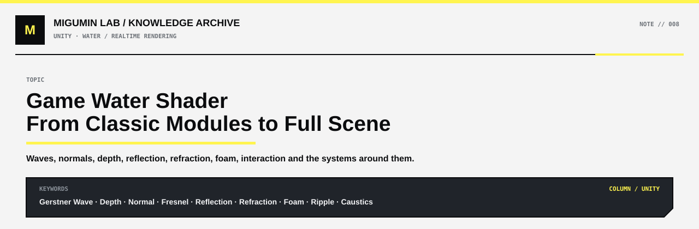

<p align="center">
  
</p>

<p align="center">
  <a href="../README.md#unity">← UNITY</a> ·
  <a href="../README.md#map">KNOWLEDGE MAP</a> ·
  <a href="https://github.com/Retourflow">PROFILE</a>
</p>

---

# 游戏水体 Shader：从经典结构到完整场景效果

游戏里的水，并不是一个单独的“透明材质”就能完成的。

一个完整的实时水体效果，通常由两部分共同组成：

- 水体 Shader 本身
- 场景、灯光、反射、地形、后处理等外围系统

如果只讨论水体 Shader，很多游戏确实都建立在一套非常经典的结构上：

```text
Water Mesh
    ↓
顶点波浪
    ↓
水深
    ↓
Normal
    ↓
Fresnel
    ↓
Reflection
    ↓
Refraction
    ↓
Foam / Ripple
    ↓
最终水面
```

但真正看到游戏里漂亮的湖泊、河流、海面时，往往还需要加入水底场景、岸边、焦散、环境反射、太阳高光、Bloom、色彩调节等系统。

所以更准确地说：

> 大多数游戏水体不会脱离那几套经典模块，但最终效果并不只是“同一个 Shader 改参数”，而是模块组合、实现方式、场景配合和渲染策略共同决定的。

---

# 水体 Shader 的经典骨架

很多实时水体最终都可以拆成下面这些核心模块：

```text
波浪位移
+
Normal 小波纹
+
Depth Color
+
Fresnel
+
Reflection
+
Refraction
+
Foam
+
Ripple
+
Interaction
```

这些模块已经可以覆盖大量游戏中的湖泊、河流、浅海和风格化水体。

不同游戏之间的差别，通常来自：

```text
用了哪些模块
+
模块怎么组合
+
数学模型怎么实现
+
性能预算是多少
+
最终美术风格是什么
```

而不只是简单地改变几个数值。

---

# Water Mesh：水体的几何基础

所有水体都必须依附在某种几何表面上。

最简单的情况就是一个 Plane：

```text
────────────
    水面
────────────
```

如果水面完全不做几何变化，那么所有波浪都只能通过 Normal 来“假装”。

一旦希望真正产生高低起伏，就必须修改顶点位置。

因此水体可以分成两个尺度：

```text
大尺度变化
→ 修改 Mesh 顶点

小尺度变化
→ 修改 Normal
```

可以简单记成：

```text
Mesh 决定大形

Normal 决定小形
```

---

# 自适应曲面细分

如果水面顶点太少，即使使用复杂的波浪数学，也很难得到平滑的水面。

例如原始水面：

```text
+---------+
|         |
|         |
|         |
+---------+
```

只有少量顶点。

执行波浪位移后可能变成：

```text
──────/\──────
```

看起来非常生硬。

因此可以先增加水面顶点：

```text
+--+--+--+--+
|  |  |  |  |
+--+--+--+--+
|  |  |  |  |
+--+--+--+--+
```

然后再执行顶点波浪。

自适应曲面细分的思想是：

```text
靠近摄像机
↓
增加更多顶点

远离摄像机
↓
减少顶点数量
```

这样可以同时兼顾画面和性能。

因此：

```text
Adaptive Tessellation
        ↓
更密集的水面 Mesh
        ↓
Gerstner Wave
        ↓
更加平滑的几何波浪
```

---

# Gerstner Wave

Gerstner Wave 是游戏水体中非常经典的波浪模型。

最简单的波浪通常只是：

```text
y = sin(x + time)
```

这种做法只会让顶点上下移动。

Gerstner Wave 则会同时改变顶点的水平位置和垂直位置：

```text
X
Y
Z
```

因此波浪会产生更真实的推挤感。

可以把它理解成：

```text
顶点位置
    ↓
波浪方向
    ↓
波长
    ↓
振幅
    ↓
速度
    ↓
sin / cos
    ↓
新的顶点位置
```

单独一组 Gerstner Wave 通常会显得太规律。

实际水体经常叠加多组：

```text
大波
+
中波
+
小波
+
不同传播方向
+
不同速度
        ↓
复杂水面
```

因此很多游戏里的大尺度水浪，并不一定需要动画贴图，而是可以直接通过数学函数计算。

---

# 波浪几何与 Normal 的区别

Gerstner Wave 主要解决的是大尺度波浪。

例如：

```text
海浪起伏
湖面缓慢波动
大型水面形状变化
```

但真实水面还有大量非常细小的纹理。

这些通常不会继续增加几何复杂度，而是通过 Normal Map 或程序法线完成。

因此常见结构是：

```text
Gerstner Wave
↓
大尺度真实几何波浪

+

Normal
↓
小尺度视觉波纹
```

这样既能保留水面的立体起伏，又不需要创建极高密度的 Mesh。

---

# 多层 Normal

水体很少只使用一张 Normal。

常见做法是：

```text
Normal A
向一个方向滚动

+

Normal B
向另一个方向滚动
```

这样可以避免水纹看起来像一张贴图单纯滑动。

进一步可以加入：

```text
大尺度 Normal
+
细节 Normal
+
Ripple Normal
+
交互 Normal
```

形成更加复杂的表面变化。

---

# RNM 法线混合

RNM 的全称是：

```text
Reoriented Normal Mapping
```

普通做法可能直接：

```text
Normal A + Normal B
```

或者简单 Lerp。

但这种方法容易让最终法线方向失真。

RNM 的思想可以理解成：

> 根据第一层 Normal 当前的方向，重新调整第二层 Normal 的方向，再进行组合。

结构可以写成：

```text
Base Normal
      ↓
   RNM Blend
      ↑
Detail Normal
      ↓
Final Normal
```

这类法线混合不仅会出现在水体里。

还经常用于：

```text
岩石
皮肤
雨水
积雪
泥土
布料
```

---

# 水深颜色

很多游戏水体都会根据水深改变颜色。

例如：

```text
岸边
→ 浅青色

中间
→ 蓝绿色

深水
→ 深蓝色
```

常见做法是利用 Scene Depth。

核心关系可以理解成：

```text
Scene Depth
-
Water Surface Depth
=
Water Depth
```

然后将这个深度映射成 Mask：

```text
浅水
↓
0

深水
↓
1
```

再使用 Lerp：

```text
Shallow Color
        ↓
      Lerp
        ↑
Deep Color
```

最终形成：

```text
浅水颜色
→
过渡颜色
→
深水颜色
```

这个逻辑和灰尘、积雪、边缘磨损本质上非常相似。

都是：

```text
先计算一个 Mask
        ↓
再决定哪里显示什么效果
```

---

# Fresnel

Fresnel 是水体中非常经典的效果。

它描述的是：

> 表面与视线夹角变化时，反射强度也会发生变化。

通常：

```text
正面看水面
→ 更容易看到水下

斜着看水面
→ 反射更强
```

所以水体常见结构是：

```text
View Direction
+
Surface Normal
        ↓
Fresnel
        ↓
控制 Reflection / Transparency
```

这也是为什么水在远处和低角度观察时，经常会出现更明显的天空反射。

---

# Reflection

水面很大一部分视觉来自反射。

常见实现包括：

```text
Skybox
Reflection Probe
Cubemap
SSR
Planar Reflection
```

不同方案的性能和质量差别很大。

比较简单的水体可能只使用：

```text
Skybox / Reflection Probe
```

更高级的水体可能加入：

```text
Screen Space Reflection
```

或者：

```text
Planar Reflection
```

水看起来是什么颜色，也会受到环境反射非常大的影响。

例如：

```text
蓝色天空
↓
水面偏蓝

阴天
↓
水面偏灰

夕阳
↓
水面偏暖
```

因此：

> 水的颜色并不完全来自 Base Color。

---

# Specular

水面通常具有非常强的镜面高光。

核心关系可以理解成：

```text
Light Direction
+
Surface Normal
+
View Direction
        ↓
Specular
```

当水面某个区域的法线方向刚好满足反射条件时，就会出现非常明亮的高光。

由于 Normal 和几何波浪一直在运动，这些亮点也会不断变化。

于是会出现水面常见的：

```text
✨ ✨ ✨ ✨
```

这种闪烁效果。

如果再配合 Bloom，就会变得更加明显。

---

# Refraction

水下物体看起来会发生扭曲。

游戏里很多实时水体并不会真正进行复杂的物理光线追踪。

常见实现是：

```text
Scene Color
        ↓
读取屏幕画面
        ↓
Normal
        ↓
偏移屏幕 UV
        ↓
重新采样
        ↓
产生视觉折射
```

简单表示就是：

```text
UV + Normal.xy × Refraction Strength
```

因此：

```text
原本笔直的物体
↓
经过水面
↓
产生扭曲
```

这是一种非常经典的屏幕空间技巧。

---

# 折射深度保护

如果直接用 Normal 偏移 Scene Color 的 UV，很容易出现错误。

例如岸边：

```text
水        陆地
~~~~~~~~|______
```

折射后的 UV 可能采样到原本不属于水下的区域。

于是会出现：

```text
岸上的颜色被拉进水里

石头被错误扭曲到水下

水边产生明显穿帮
```

因此需要结合深度判断。

核心思想是：

```text
当前水面深度
+
被采样位置深度
        ↓
比较
        ↓
判断该区域是否真的属于水下
```

这就是所谓的：

```text
Refraction Depth Protection
```

它本质上是：

```text
Depth Buffer
+
Scene Color
+
条件判断
```

---

# 程序化 Ripple

Ripple 指的是从某个点向外扩散的水波。

例如：

```text
      ○
    ○   ○
  ○       ○
```

一个经典程序化做法是计算：

```text
distance(position, rippleCenter)
```

得到每个点到波纹中心的距离。

然后：

```text
sin(distance × Frequency - Time × Speed)
```

就可以得到不断向外传播的圆形波。

流程可以理解成：

```text
Ripple Center
        ↓
计算距离
        ↓
Distance
        ↓
sin()
        ↓
波纹环
        ↓
Time
        ↓
向外运动
```

这类效果本质上属于：

```text
坐标
→
数学函数
→
动画
```

---

# 动态水体交互

程序 Ripple 可以预先指定中心。

但游戏里更常见的需求是：

```text
角色踩水
石头掉进水里
物体划过水面
```

这些都需要动态交互。

一种常见结构是：

```text
交互物体
        ↓
Interaction Position
        ↓
写入 Render Texture
        ↓
Ripple / Height Simulation
        ↓
生成 Height / Normal
        ↓
Water Shader 读取
```

于是角色走过水面后，水波可以继续传播。

这时候就不只是一个简单的 Shader 参数。

而是：

```text
Gameplay
+
Render Texture
+
Simulation
+
Water Shader
```

共同组成的系统。

---

# 程序化 Ripple 与水波模拟的区别

简单 Ripple：

```text
sin(distance - time)
```

本质上只是数学动画。

它并不知道上一帧发生了什么。

真正的水波模拟则可能使用：

```text
上一帧高度
+
上一帧速度
+
周围像素高度
        ↓
计算下一帧
```

形成类似 Wave Equation 的传播。

因此：

```text
程序 Ripple
→ 视觉效果

Wave Simulation
→ 状态持续传播
```

两者都可以表现水波，但复杂度完全不同。

---

# 浪尖和 Foam

浪尖泡沫通常不是随便贴一张白色纹理。

如果已经有 Gerstner Wave，就可以利用波浪本身的信息生成 Mask。

例如：

```text
Wave Height
        ↓
Smoothstep
        ↓
Crest Mask
```

只有较高的部分变成白色。

还可以进一步加入：

```text
Wave Height
+
Wave Slope
+
Noise
        ↓
Foam Mask
```

最终：

```text
Foam Mask
        ↓
白色泡沫
```

这个思想和积雪、灰尘非常接近。

积雪：

```text
Normal 朝上程度
+
Noise
        ↓
Snow Mask
```

灰尘：

```text
Normal 朝上程度
+
AO
+
Noise
        ↓
Dust Mask
```

浪尖：

```text
Wave Height
+
Slope
+
Noise
        ↓
Foam Mask
```

核心逻辑始终是：

> 先找到“哪里”，再决定“那里显示什么”。

---

# 岸边 Foam

除了浪尖泡沫，岸边通常还会有另一种泡沫。

可以通过水深判断：

```text
Water Depth
        ↓
Shore Mask
```

当水非常浅时：

```text
Shore Mask ≈ 1
```

然后加入：

```text
Noise
+
流动纹理
+
时间
```

最终形成岸边白色泡沫。

因此水体通常会同时存在：

```text
Crest Foam
波峰泡沫

+

Shore Foam
岸边泡沫
```

---

# Caustics 焦散

浅水区域经常会看到水底出现明亮的移动光纹。

这就是 Caustics。

现实里，它来自水面折射光线后形成的光能聚集。

游戏里通常不会真正模拟完整光学过程。

比较常见的方法是：

```text
Caustics Texture
+
UV Animation
+
Depth Mask
        ↓
投射到水底
```

也可以使用两层纹理：

```text
Caustics A
向一个方向移动

+

Caustics B
向另一个方向移动
```

形成不断变化的光纹。

Caustics 对浅水效果非常重要。

尤其是清澈水体。

---

# 为什么水底场景非常重要

很多漂亮水体之所以看起来“清澈”，并不只是因为 Water Shader。

而是因为水下面本身就有很多视觉信息。

例如：

```text
沙地
石头
水草
莲叶
地形高低变化
```

折射真正能表现出来的前提，是下面有东西可以折射。

如果水下面只有：

```text
一张空白平面
```

那么再好的 Refraction 也很难产生丰富的视觉效果。

因此浅水场景经常会认真制作：

```text
Water Shader