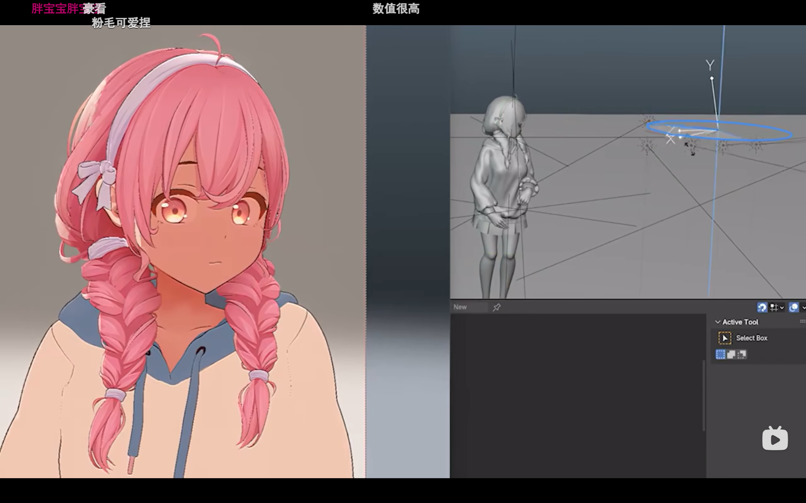
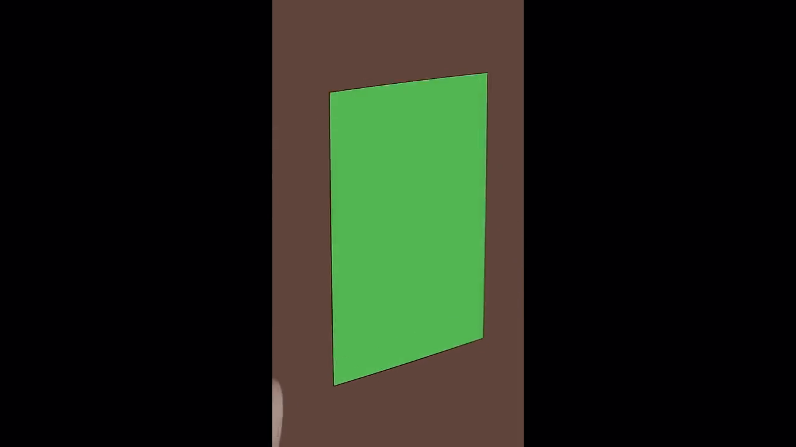
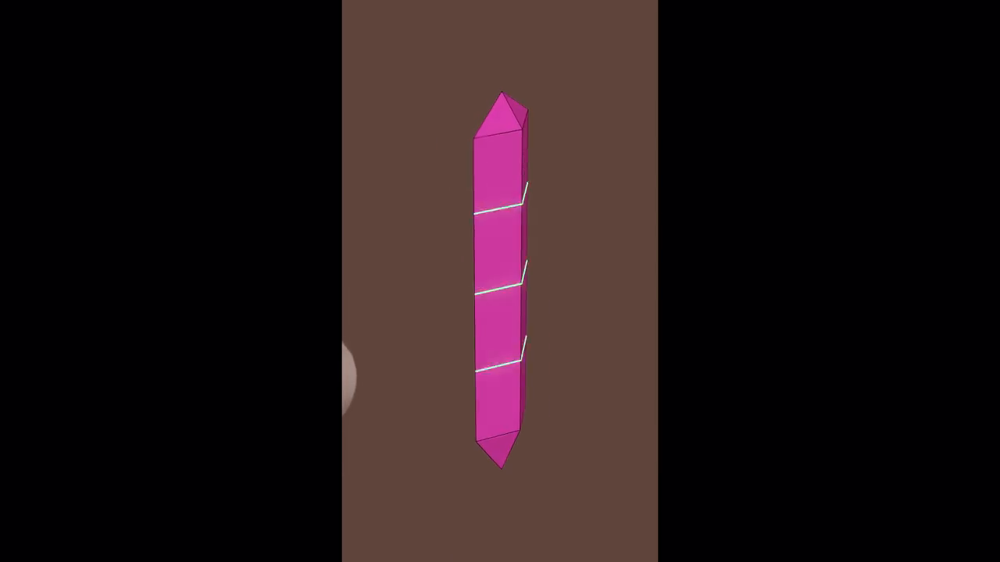
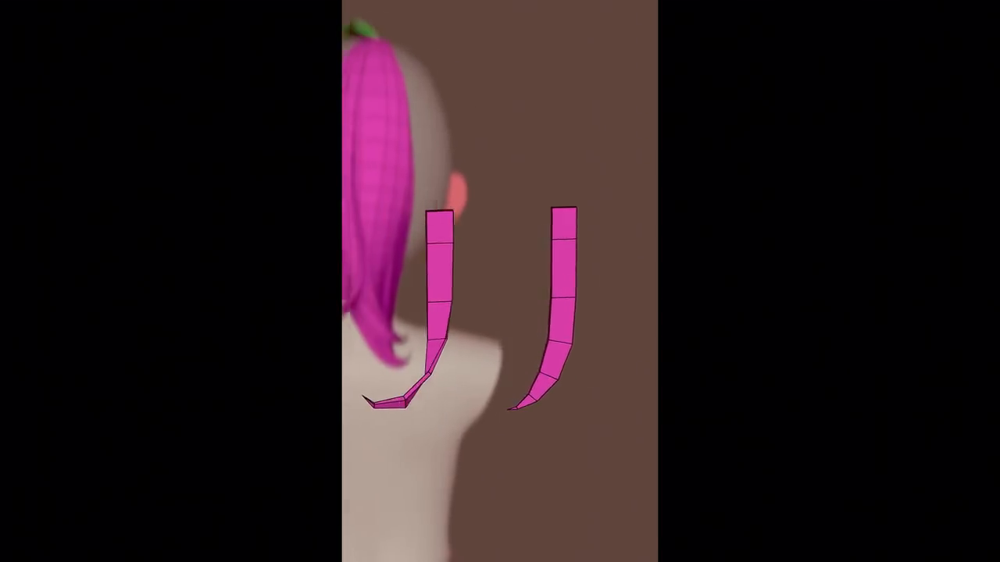
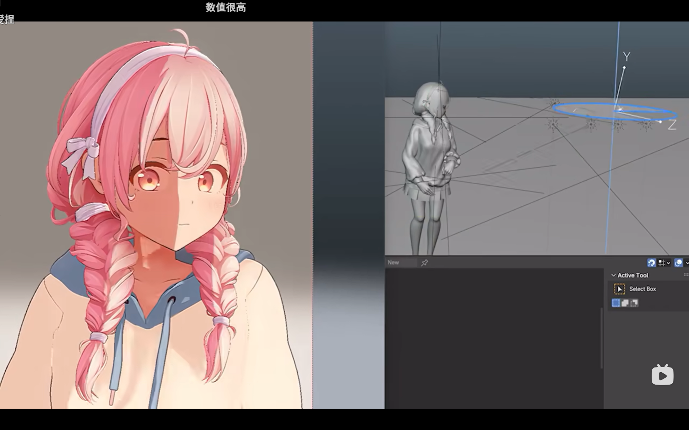
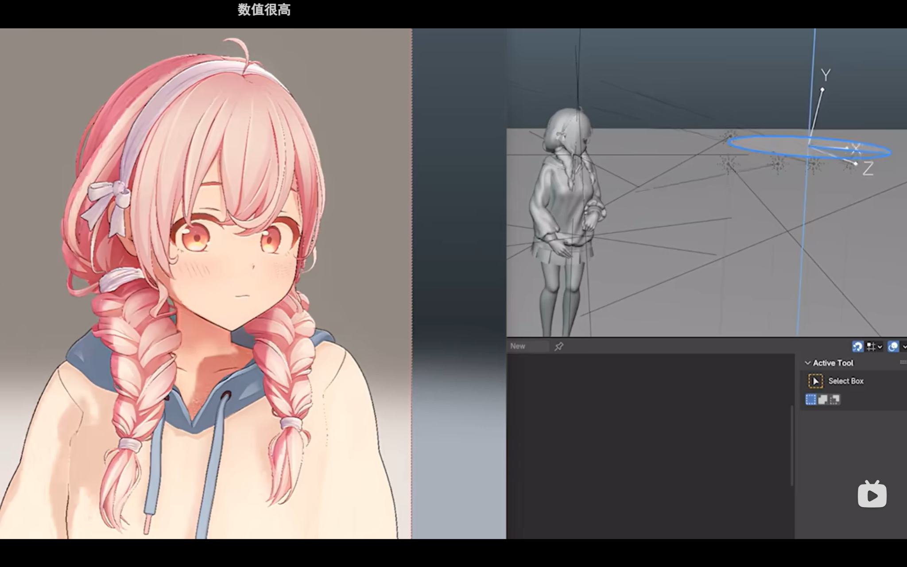
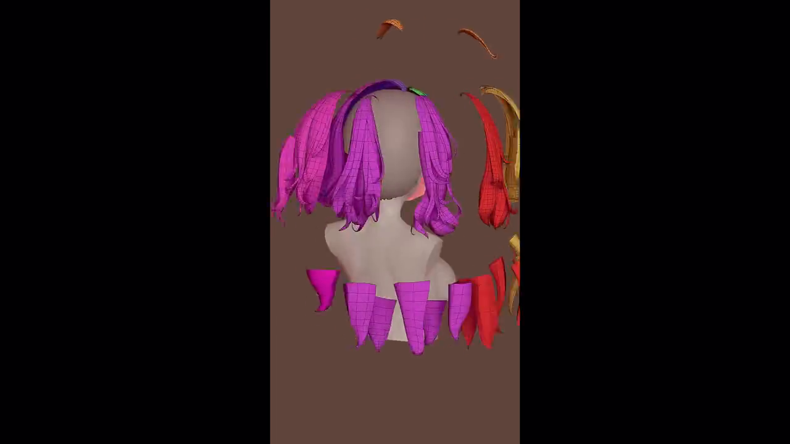
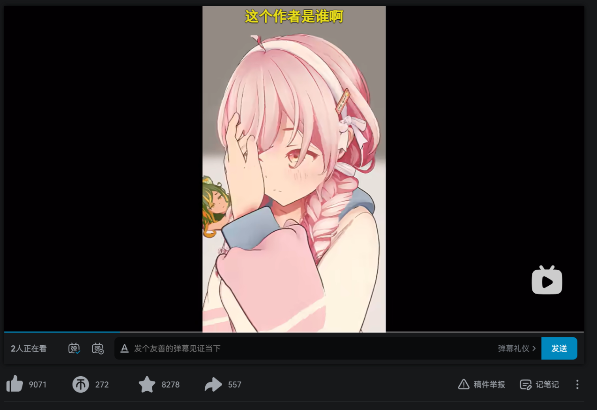
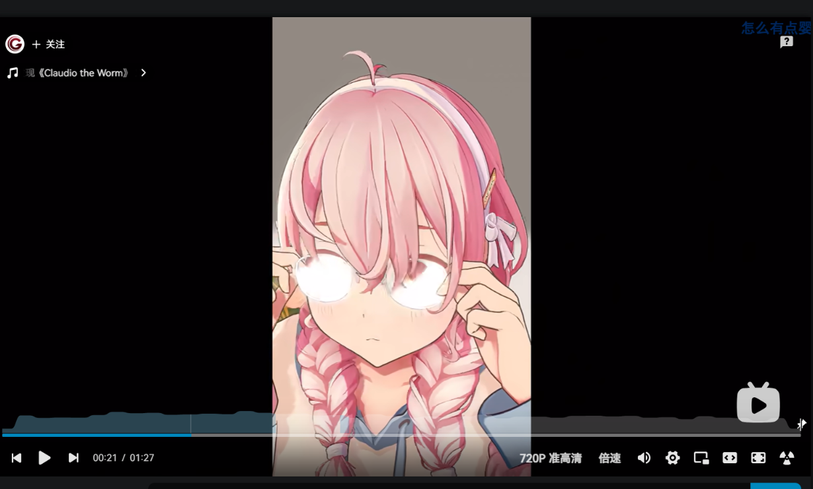
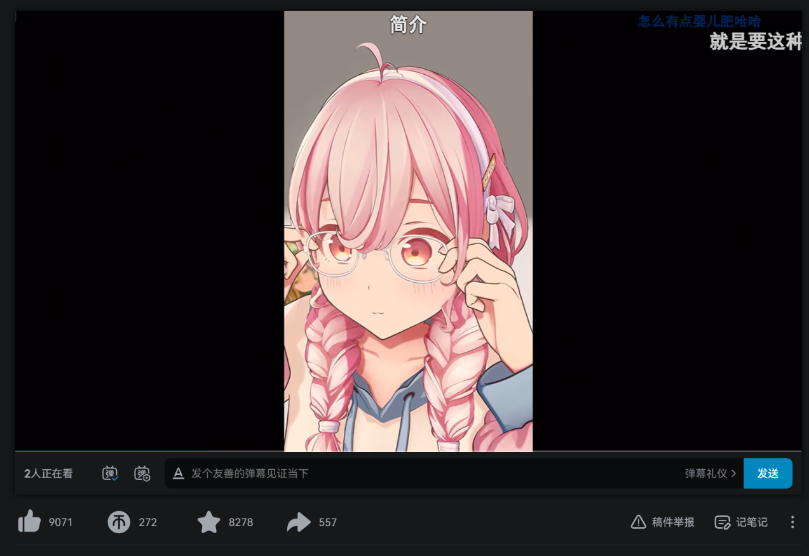

# 三渲二角色建模与 Toon Shader：Geometry、Normal 与光照的分工

> 原始学习来源：<https://www.youtube.com/shorts/4vrT-nUlhXw>

# 对 [https://www.youtube.com/shorts/4vrT-nUlhXw](https://www.youtube.com/shorts/4vrT-nUlhXw) 的学习

作者：MIGUMIN

这段视频适合用来理解一种很典型的三渲二思路：**角色最终的二维感不一定来自非常复杂的 Shader，也可以大量来自模型本身的几何造型，再配合简单、稳定的 Toon Lighting。**

这篇笔记把两类内容分开：

> **视频观察**：可以直接从画面、灰模、拓扑或灯光变化中看到的内容。  
> **原理扩展**：为了理解这些现象而补充的 Shader / Normal 知识。视频没有公开完整 Shader Nodes，因此不能把某一种节点实现断言成作者的唯一做法。

---

## 从最终效果看，这个角色不是靠复杂贴图撑起来的



从最终画面看，皮肤、衣服和头发都表现得非常干净。

尤其是头发，没有明显看到传统写实或游戏头发里常见的：

```text
复杂发丝 Base Color
+
Hair Specular Mask
+
Flow Map / Tangent 高光
+
大量细碎发丝纹理
```

它更像：

```text
几何造型
+
简单颜色
+
法线
+
Toon Lighting
↓
最终的二次元明暗
```

眼睛是一个明显的例外。

眼睛里可以看到虹膜、颜色渐变、瞳孔和高光等信息，这类细节很适合通过贴图或更复杂的材质实现。

但从视频本身不能严格证明“眼睛之外完全没有贴图”。更准确的说法是：

> **这个角色大量可见的造型信息明显来自 Geometry，而不是依赖复杂纹理去伪造。**

---

## 头发的重点在 Geometry，而不是 Hair Shader



视频直接展示了头发的制作过程。

作者不是拿一大片简单 Hair Card，再主要依靠透明贴图画出发丝，而是把很多发束直接做成真正的 Mesh。

整体思路可以理解为：

```text
基础平面 / 简单网格
↓
切出规则四边面
↓
调整轮廓
↓
弯曲成发束
↓
塑造尖端与体积
↓
大量发束组合成完整发型
```

这意味着刘海的分叉、侧发的形状、卷曲、发尾、层次和很多起伏，本身就已经存在于三维几何里。



这张灰模画面尤其能说明问题。

即使没有最终颜色和 Toon 渲染，发型已经成立。

也就是说：

> **Shader 并不是把一个普通、简单的头模“变成”漂亮头发；模型本身已经承担了非常多视觉设计。**

这可以理解成一种 **Geometry-driven NPR**：

```text
更多信息做进 Geometry
↓
材质可以更简单
↓
Shader 只需要稳定地解释光照
```

---

## 这种头发为什么可以不用明显的专用高光



从视频最终画面来看，没有明显看到非常典型的二次元专用头发高光带。

例如没有特别明显的：

```text
沿头部横向滑动的高光条
双层 Anisotropic Specular
明显依赖 Tangent 的发丝高光
独立 Hair Highlight Mask
```

但是头发仍然有丰富的亮暗。

原因在于，一根真实弯曲的发束本身就会产生不同的表面朝向。

```text
发束弯曲
↓
表面方向变化
↓
Normal 变化
↓
与光线方向的关系变化
↓
亮暗变化
```

所以即使 Shader 很基础，只要 Geometry 做得足够细，最终也可以出现漂亮的大块明暗。

---

## 视频里的灯光变化很像经典 Toon Lighting

下面三张是同一个角色在不同光照方向下的画面。






可以看到模型没有发生变化，但：

```text
脸
头发
辫子
衣服
```

都会随着光照方向一起发生明显的明暗切换。

尤其是脸部，中间出现了很明确的亮暗边界，而不是连续、柔软的写实渐变。

从视觉结果看，它非常符合经典 Toon / Cel Shading 的特征：

```text
连续光照
↓
经过 Threshold / Ramp
↓
压成少量几个色阶
↓
形成干净的动画色块
```

这里要注意：

> 视频没有展示 Shader Nodes，所以不能断言作者一定使用某个特定 Blender 节点组合。

但从原理上，可以用最经典的 `Normal → N·L → Toon Ramp` 来理解画面为什么会这样变化。

---

## Normal 是什么

Normal 可以先简单理解为：

> **一个表面“朝向哪里”的方向信息。**

真正决定模型几何位置的是 Vertex Position。

```text
Vertex Position
→ 决定顶点真正在哪里
→ 决定模型轮廓和真实形状
```

而 Normal 更像是在告诉 Shader：

```text
这个表面朝哪里
↓
应该怎样接受光照
```

所以非常重要的一句话是：

> **Vertex Position 决定模型真正长什么样，Normal 决定这个模型怎样被光照理解。**



例如头发本身是弯曲的，不同位置的表面方向自然不一样，于是不同区域参与光照计算时会得到不同结果。

---

## `N · L` 是最基础的法线光照关系

为了知道一个表面朝不朝向光源，可以比较：

```text
N = Normal，表面方向
L = Light Direction，光线方向
```

最经典的计算就是：

```text
N · L
```

也就是两个方向的点积。

可以先粗略记成：

```text
N · L 较高
→ 表面更朝向光
→ 更亮

N · L 接近 0
→ 表面和光线接近垂直
→ 更暗

N · L 很低或为负
→ 表面背向光
→ 通常进入背光区域
```

如果直接保留这种结果，光照通常是连续变化的：

```text
1.0
0.9
0.8
0.7
0.6
0.5
0.4
0.3
...
```

所以表面会从亮到暗连续过渡。

---

## Toon Lighting 做的是“把连续光照离散化”

Toon Lighting 并不一定要重新发明一整套光照。

它最核心的事情，可以简单理解为：

> **先得到光照强度，再把连续强度压成少量几个明确色阶。**

例如原始光照：

```text
亮 → → → → → 暗
```

经过 Toon 处理后：

```text
亮面
████████

暗面
████████
```

中间出现明显边界。

一个极度简化的概念写法可以是：

```glsl
float light = dot(normal, lightDirection);

if (light > threshold)
    color = lightColor;
else
    color = shadowColor;
```

真实项目当然可以继续加入：

```text
中间色
多段 Ramp
阴影颜色
Face Shadow
Rim Light
Outline
特殊高光
```

但最基础的思维仍然是：

```text
Geometry
↓
Normal
↓
N · L
↓
Ramp / Threshold
↓
二次元亮面与暗面
```

---

## “法线阴影”和 Toon Lighting 是前后关系

日常讨论里有时会把“由法线方向产生的明暗”随口叫成“法线阴影”，但更准确地说，这是**法线参与光照计算得到的明暗结果**。

它与 Toon Lighting 不是两套互相竞争的东西，而是可以前后连接：

```text
Normal
+
Light Direction
↓
N · L
↓
先得到原始光照强度
↓
Toon Ramp / Threshold
↓
再把连续亮度变成二次元色块
```

所以可以记成：

> **Normal / N·L 负责判断哪里应该亮、哪里应该暗。**

> **Toon Lighting 负责把这些亮暗变成什么样的二次元画面。**

---

## 为什么有时要“欺骗 Shader”

真实几何产生的光照，不一定符合风格化角色的美术需求。

例如一个真实脸部有：

```text
鼻子凸起
眼窝凹陷
嘴角曲率
脸颊弧面
```

如果完全按真实几何的表面方向去做非常硬的 Toon 阴影，就可能出现：

```text
鼻子突然一块黑
眼窝变暗
嘴边出现碎阴影
脸上色块非常杂
```

写实渲染里这些可能很合理，但二次元脸往往更希望：

```text
大块
干净
可控
有设计感
```

所以风格化渲染里经常会出现这样的思路：

```text
真实 Geometry
↓
人为调整 Normal
↓
Shader 接收到“更适合美术效果”的表面方向
↓
得到更干净的光照
```

把它说成“欺骗 Shader”很容易理解：

> **模型实际没有变，但故意让 Shader 对表面方向产生不同的理解。**

---

## Normal Map 也是一种“修改 Shader 看到的 Normal”的办法

Normal Map 不会真的把一个平面顶起来。

它做的是：

```text
真实 Geometry
保持不变
+
Normal Map
改变像素级表面方向
↓
Shader 计算出新的光照
```

例如真实模型是平面：

```text
────────────
```

Normal Map 可以让不同像素告诉 Shader：

```text
这里朝左一点
这里朝上一点
这里朝右一点
```

于是从光照上看起来，就像表面存在凹凸。

这也是为什么 Normal Map 很常用于：

```text
低模
+
Normal Map
↓
表现更多小尺度表面细节
```

但要注意，这段视频本身没有直接展示 Normal Map。

这里是为了理解“Geometry 不变，但 Normal 可以改变光照”的概念扩展。

---

## Normal Map 和 Vertex Normal 要区分

两者都会影响 Shader 使用的 Normal，但尺度和用途通常不同。

Normal Map 更常见于：

```text
像素级变化
细小凹凸
纹理
划痕
布料纹理
皮肤小细节
```

Vertex Normal 更适合控制较大的整体光照造型：

```text
脸部大范围明暗
头发整体受光
风格化物体的大色块
```

例如一个脸部模型保持原来的顶点位置：

```text
脸型不变
鼻子几何不变
轮廓不变
```

但是把 Vertex Normal 调整得更平滑、更接近一个理想化曲面：

```text
Vertex Normal 改变
↓
N · L 改变
↓
Toon 阴影形状改变
```

于是脸上的阴影可以变得更干净。

---

## 修改 Vertex Normal 不会改变模型真实形状

这是非常容易混淆的一点。

只修改 Vertex Normal，不会改变：

```text
顶点位置
模型轮廓
真实体积
拓扑结构
碰撞形状
```

模型 Geometry 还是原来的 Geometry。

变化的是：

```text
Shader 如何理解表面方向
↓
亮暗变化
↓
高光位置变化
↓
视觉上的体积感变化
```

所以一个平面完全可以保持几何上的平面，但因为 Normal 被重新设计，光照看起来像一个曲面。

因此最准确的理解是：

> **几何形状没有变，但“看起来的形状感”可能会变。**

这是一种 Shading Illusion。

---

## 这个视频为什么是一个很典型的 Geometry-driven NPR 例子

这套做法的核心不是“用特别复杂的 Shader 修复一个普通模型”，而是反过来：

```text
角色造型先做得非常完整
↓
头发发束真实建出来
↓
轮廓与体积主要由 Geometry 保证
↓
材质可以保持简单
↓
Toon Lighting 负责把光照变成二维色块
```

最终：

```text
精细 Geometry
+
简单 Material
+
Normal
+
经典 Toon Lighting
+
动画与演出
↓
漂亮的三渲二角色
```

这也是为什么画面很好看，但 Shader 本身未必需要复杂到商业游戏角色 Shader 那种程度。

---

## Shader 容易统一，但角色模型很难完全统一

这个视频也很好地说明了生产上的差异。

一套 Toon Shader 写好以后，可以在很多角色之间复用：

```text
Character A
Character B
Character C
Character D
↓
同一套 Master Toon Shader
```

新角色通常只需要调整：

```text
Base Color
Shadow Color
Threshold
Outline
局部参数
```

所以 Shader 往往属于：

> **第一次开发成本高，但之后边际成本很低。**

角色建模不同。

即使共享：

```text
人体 Base Mesh
Skeleton
Topology 规范
UV 规范
Shader
Rig 规则
```

真正决定角色个性的部分仍然经常需要单独制作：

```text
Face
Hair
Clothing
Accessories
Silhouette
```

尤其像视频里的头发。

双麻花辫和短发可以使用同一套 Toon Shader，但几何本身几乎不可能直接共用成同一个最终造型。

所以更准确的说法不是“角色完全不能统一”，而是：

> **底层生产规范可以统一，最终角色造型不能完全统一。**

这也是为什么角色资产生产一直是很大的工作量。

---

## 为什么这种模型特别适合观察“模型与 Shader 的分工”







视频后半段还展示了手部动作和眼镜动画。

这说明角色并不是只为了一个固定角度渲染的二维假象，而是一个可以真正参与：

```text
骨骼动画
手部动作
道具运动
镜头变化
灯光变化
```

的三维角色。

其中眼镜短暂整体变白，也很像典型的风格化演出逻辑：

```text
真实物理反射
不是唯一目标

动画表现需要
↓
可以故意让镜片出现非常夸张的白色闪光
```

这再次说明 NPR 的核心：

> **最终目标不是物理上绝对正确，而是视觉和演出上正确。**

---

## 这段视频最值得记住的结构

可以把整套关系压缩成：

```text
角色造型
↓
Geometry
↓
Vertex Position 决定真实形状
↓
Normal 告诉 Shader 表面朝向
↓
N · L 得到基础光照关系
↓
Toon Ramp 把连续光照离散化
↓
形成二次元亮面 / 暗面
↓
必要时人为修改 Normal
↓
让光照更加符合美术需求
↓
动画与演出
↓
最终三渲二画面
```

再压缩成一句话：

> **Geometry 决定“东西是什么形状”，Normal 决定“光认为它朝哪里”，Toon Shader 决定“这些光照怎样被画成二次元色块”。**

而 Normal Map / Edited Vertex Normal 的意义，就是：

> **在不一定改变真实 Geometry 的情况下，重新控制 Shader 对表面方向的理解。**

这也是风格化渲染里非常核心的一种思维：

> **不是追求物理正确，而是追求视觉正确。**