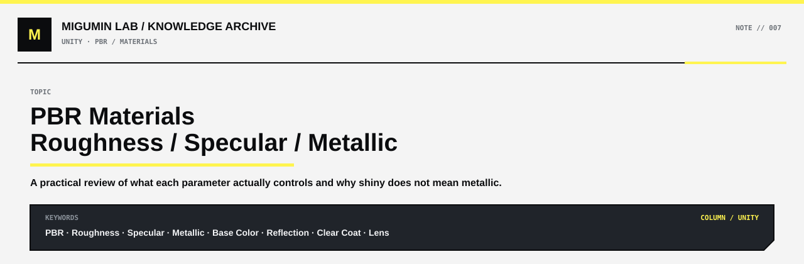

<p align="center">
  
</p>

<p align="center">
  <a href="../README.md#unity">← UNITY</a> ·
  <a href="../README.md#map">KNOWLEDGE MAP</a> ·
  <a href="https://github.com/Retourflow">PROFILE</a>
</p>

---

# PBR 中 Roughness、Specular 与 Metallic 的关系

在 PBR 材质里，`Roughness`、`Specular` 和 `Metallic` 经常会一起出现，但它们控制的并不是同一件事。

可以先用一句话记住：

> **Metallic 决定材质类型，Roughness 决定反射形状，Specular 决定非金属表面的镜面反射强度。**

也可以理解成三个问题：

```text
Roughness
→ 反射清不清楚？

Specular
→ 非金属表面的反射有多强？

Metallic
→ 这个表面是不是金属？
```

---

## Roughness：粗糙度

`Roughness` 控制的是表面在微观尺度上有多粗糙。

它最直接影响的是：

- 高光有多集中
- 反射有多清晰
- 环境倒影有多模糊

可以简单理解为：

```text
Roughness = 0

表面非常光滑
↓
光线反射方向比较统一
↓
高光集中
↓
倒影清晰
```

而：

```text
Roughness = 1

表面非常粗糙
↓
光线向很多方向散射
↓
高光扩散
↓
倒影模糊
```

一些常见材质大概可以理解为：

```text
镜子 / 抛光玻璃
Roughness ≈ 0 ~ 0.1

光滑塑料
Roughness ≈ 0.2 ~ 0.4

普通木头
Roughness ≈ 0.4 ~ 0.7

布料 / 粗糙石头
Roughness ≈ 0.6 ~ 1.0
```

不过这些数值只是理解范围，不是固定标准。真实材质通常会通过 Roughness 贴图让表面不同区域拥有不同粗糙度。

### Roughness 不等于“反不反光”

这是非常重要的一点。

`Roughness` 并不是单纯控制：

> 有反射 / 没有反射

它更接近：

> **反射出来的东西是清晰集中，还是模糊扩散。**

例如一个表面：

```text
Specular 较高
Roughness 较高
```

仍然可能有很强的高光，但高光会比较宽、比较散。

而：

```text
Specular 正常
Roughness 很低
```

就可能出现非常锐利、非常清楚的高光。

所以 Roughness 更像是在控制：

```text
反射的“形状”和“清晰度”
```

而不是简单控制反射有没有。

---

## Specular：镜面反射强度

`Specular` 主要用于控制**非金属材质的镜面反射强度**。

现实中的很多非金属材质同样会反光，例如：

- 塑料
- 水
- 玻璃
- 皮肤
- 陶瓷
- 油漆

这些都不是金属，但它们都会产生镜面反射。

可以简单理解为：

```text
Specular 较低
↓
表面的镜面反射比较弱
```

```text
Specular 较高
↓
表面的镜面反射比较强
```

这里最容易和 Roughness 混淆。

两者其实分别控制不同东西：

```text
Specular
↓
反射强度

Roughness
↓
反射清晰程度
```

例如：

```text
Specular 高
Roughness 高
```

意味着：

```text
反射很明显
+
反射很散
```

最后看到的可能是一大片宽而柔和的高光。

而：

```text
Specular 正常
Roughness 很低
```

意味着：

```text
反射强度正常
+
反射非常集中
```

于是会出现很锐利的高光和比较清楚的环境反射。

---

## 为什么普通 PBR 材质里 Specular 往往不用频繁调整

在标准 PBR 工作流中，大部分普通非金属材质的反射率其实落在一个比较稳定的范围内。

因此在实际游戏材质制作里，通常不会为了“让东西更亮”就随便修改 Specular。

很多时候真正频繁调整的是：

```text
Base Color
Roughness
Metallic
Normal
```

而 Specular 往往保持默认值。

尤其是在 Unreal Engine 这类标准 PBR 系统里，普通塑料、木头、布料、石头等材质通常不需要大幅修改 Specular。

只有在你明确知道材质的物理性质和默认值不匹配时，才比较有必要调整。

---

## Metallic：金属度

`Metallic` 控制的是：

> **这个表面是不是金属。**

最基本的理解：

```text
Metallic = 0
→ 非金属

Metallic = 1
→ 金属
```

例如：

```text
塑料
Metallic = 0

玻璃
Metallic = 0

木头
Metallic = 0

布料
Metallic = 0

皮肤
Metallic = 0

水
Metallic = 0
```

而：

```text
铁
Metallic = 1

铜
Metallic = 1

金
Metallic = 1

铝
Metallic = 1
```

### Metallic 不是“反光强度”

这是 PBR 里很常见的误区。

很多初学者看到一个材质特别亮，就会产生这样的思路：

```text
这个东西很亮
↓
它反光很强
↓
把 Metallic 拉高
```

但这是不对的。

因为：

> **非金属一样可以非常光滑、非常亮、非常反光。**

例如：

- 玻璃
- 水面
- 黑色烤漆
- 光滑塑料
- 树脂
- 清漆

这些都可以产生非常强烈的环境反射，但它们依然是：

```text
Metallic = 0
```

所以 Metallic 不是在告诉 Shader：

```text
“我要不要反光”
```

而是在告诉 Shader：

```text
“我要按照金属的光学规律来计算”
```

或者：

```text
“我要按照非金属的光学规律来计算”
```

---

## 非金属是怎样反射光的

对于普通非金属材质来说，光照到表面之后，大致可以理解为两部分。

```text
        光
        ↓

┌──────────────┐
│   非金属表面   │
└──────────────┘
     ↙      ↘

表面反射       光进入材质内部
Specular         ↓
                 散射 / 吸收
                 ↓
               Diffuse
```

所以一个非金属表面通常同时存在：

```text
Diffuse
+
Specular
```

例如白色塑料。

它看起来是白色，主要来自 Diffuse。

但在灯光照射下，它表面仍然会出现一个白色高光，这就是 Specular。

---

## 金属是怎样反射光的

金属与非金属最大的不同之一，就是金属基本不会像普通非金属一样形成明显的 Diffuse。

可以简单理解成：

```text
        光
        ↓

┌──────────────┐
│     金属表面    │
└──────────────┘
        ↓

大量能量通过表面反射表现
        ↓

Specular Reflection
```

因此：

```text
Metallic = 1
```

之后，材质的主要颜色表现来自反射，而不是普通的漫反射。

这也是为什么金属和塑料即使颜色相同，看起来也完全不一样。

---

## Base Color 在金属和非金属中的意义不同

这是理解 Metallic 很关键的一点。

对于非金属：

```text
Metallic = 0
```

此时：

```text
Base Color
≈ 材质自身的漫反射颜色
```

例如：

```text
红色塑料

Base Color = 红色
Metallic = 0
```

那么红色主要来自材质本身的 Diffuse。

---

对于金属：

```text
Metallic = 1
```

此时 Base Color 更接近：

```text
金属反射的颜色
```

例如：

```text
黄金
→ 偏黄色的反射

铜
→ 偏红橙色的反射

铝
→ 接近银白色反射
```

所以金属并不是单纯：

```text
“把一个普通材质变得更亮”
```

而是整个光照计算方式都发生了变化。

---

## Metallic 通常更接近 0 或 1

在标准 PBR 工作流里，Metallic 一般被当成接近二值的参数使用：

```text
0
→ 非金属

1
→ 金属
```

现实里当然可以存在金属表面被灰尘、锈迹、油漆等覆盖的情况。

因此 Metallic 贴图中会出现灰度过渡。

但这种过渡往往表示：

```text
一个像素区域里
金属和非金属覆盖物的混合
```

而不是说：

```text
“这个材料本身只有 50% 是金属”
```

例如一块金属板：

```text
裸露金属区域
Metallic = 1

油漆覆盖区域
Metallic = 0

边缘磨损区域
Metallic 从 0 过渡到 1
```

---

## 三个参数放在一起理解

把三个参数放在一起，可以这样看：

| 参数 | 它回答的问题 | 低值 | 高值 |
|---|---|---|---|
| `Roughness` | 表面有多粗糙？ | 光滑、反射清晰 | 粗糙、反射模糊 |
| `Specular` | 非金属镜面反射多强？ | 反射较弱 | 反射较强 |
| `Metallic` | 是不是金属？ | 非金属 | 金属 |

最核心的区别是：

```text
Metallic
↓
决定材质属于哪一类

Roughness
↓
决定反射是清晰还是模糊

Specular
↓
决定非金属表面反射强度
```

---

## 一个光滑塑料和金属的对比

假设两个材质看起来都非常亮。

### 光滑黑色塑料

```text
Base Color = 黑色
Metallic = 0
Roughness = 0.05
Specular = 正常
```

结果：

```text
非金属
+
表面非常光滑
+
有清晰的环境反射
```

它完全可以像镜子一样反射灯光。

---

### 抛光黑色金属

```text
Base Color = 深色
Metallic = 1
Roughness = 0.05
```

结果：

```text
金属
+
表面非常光滑
+
主要依靠反射表现材质
```

两者都可以很亮，但底层的光照逻辑不同。

这就是为什么：

> **“看起来很反光”不能作为判断 Metallic 的依据。**

---

## 玩偶眼睛的材质分析

以这种玩偶或机器人的眼睛为例，表面看起来：

- 有非常明显的环境高光
- 白色灯条反射比较清晰
- 表面有凸出的镜片感
- 里面仍然能看到眼睛图案

这种材质更像：

```text
外层
Convex Lens / 镜片

Metallic = 0
Roughness 很低
Specular 正常或稍高
```

而不是：

```text
Metallic = 1
```

因为现实里的：

- 塑料镜片
- 树脂
- 亚克力
- 玻璃

本身都属于非金属。

但只要表面足够光滑，它们一样可以产生很明显的环境反射。

---

## 玩偶眼睛可能使用的两层结构

这种眼睛很可能并不是只有一个材质层。

可以理解成：

```text
外层 Mesh
Convex Lens
↓
负责镜片反射

内层 Mesh
Eye / Screen
↓
负责眼睛图案
```

结构大概是：

```text
        环境灯光
            ↓

       ↘   反射   ↗

      ______________
    /                \
   /   外层镜片 Lens   \
  /____________________\
          ↓
     内部眼睛图案
     Eye / Screen
```

外层镜片可能负责：

```text
Low Roughness
+
Specular Reflection
+
Clear Coat
```

内层负责：

```text
眼睛颜色
瞳孔
屏幕图案
Emission
```

于是最终就会看到：

```text
外层有清晰环境反射
+
内部眼睛图案仍然存在
```

这种方式比单纯把眼睛贴图的 Roughness 调低，更容易产生明显的“镜片包覆感”。

---

## 为什么玩偶眼睛不是普通意义上的“金属镜子”

如果它真的按照典型金属镜面来处理：

```text
Metallic = 1
Roughness ≈ 0
```

那么外层会非常强烈地表现环境反射。

内部眼睛图案反而可能不容易表现。

但如果使用：

```text
Metallic = 0
Roughness = 0.03 ~ 0.15
Specular = 默认或稍高
```

就更容易得到：

```text
光滑塑料
玻璃
树脂
亚克力镜片
```

这种视觉效果。

所以更准确的描述应该是：

> 玩偶眼睛外面可能套了一层凸面的低粗糙度非金属镜片，通过强烈的 Specular Reflection 或 Clear Coat 反射环境，而真正的眼睛图案位于镜片内部。

---

## Clear Coat 和这三个参数的关系

某些材质表面除了基础材质之外，还会额外覆盖一层透明光滑涂层。

例如：

- 汽车清漆
- 抛光木器
- 树脂表面
- 塑料保护层
- 玩具镜片

这种情况下可以使用类似 `Clear Coat` 的模型。

可以理解成：

```text
外层
Clear Coat
↓
负责非常锐利的表面反射

内层
Base Material
↓
负责原本材质表现
```

例如：

```text
Clear Coat = 1
Clear Coat Roughness = 0.05
```

就可能在原本材质上再叠加一层非常光滑的高光。

因此像玩偶眼睛这种：

```text
内部有图案
+
外面像有一层透明亮壳
```

的效果，Clear Coat 也非常适合。

---

## 常见误区

### “东西很亮，所以 Metallic 应该高”

错误。

玻璃、水、塑料和树脂都可以非常亮，但它们仍然是：

```text
Metallic = 0
```

真正应该先观察的是：

```text
材质到底是不是金属
```

而不是：

```text
它亮不亮
```

---

### “Roughness 越低，反射越强”

不完全正确。

更准确地说：

```text
Roughness 越低
↓
反射越集中
↓
高光越锐利
↓
倒影越清晰
```

它并不是简单改变反射能量，而是改变反射的分布。

---

### “Specular 和 Roughness 是一回事”

不是。

可以继续用这个关系记：

```text
Specular
= 强度

Roughness
= 清晰程度
```

---

### “镜面材质一定是金属”

不是。

现实中的镜面感可以来自：

```text
低 Roughness
+
正常或较强 Specular
```

玻璃、水、塑料、树脂和清漆都能形成很强的镜面效果。

---

## 实际分析游戏材质时的顺序

看到一个游戏里的材质时，可以先按这种思路判断：

```text
这是什么材料？
↓
金属还是非金属？
↓
决定 Metallic

表面光滑还是粗糙？
↓
决定 Roughness

非金属的表面反射是否特殊？
↓
再考虑 Specular

表面有没有细小凹凸？
↓
看 Normal

表面颜色和纹理是什么？
↓
看 Base Color
```

所以大多数情况下，你真正频繁观察的是：

```text
Base Color
+
Roughness
+
Metallic
+
Normal
```

Specular 往往属于辅助参数。

---

## 最终记忆方式

可以把三个参数压缩成：

```text
Metallic
决定“是什么材质”

Roughness
决定“反射有多清楚”

Specular
决定“非金属反射有多强”
```

或者直接记：

> **Metallic 决定材质类型，Roughness 决定反射形状，Specular 决定非金属反射强度。**

再结合一个典型的镜片材质：

```text
Base Color    = 黑色 / 深色
Metallic      = 0
Roughness     = 0.03 ~ 0.15
Specular      = 默认或稍高
```

最终得到的并不是金属，而是：

```text
非常光滑
+
有明显环境反射
+
具有玻璃 / 树脂 / 亚克力镜片感
```

这正是很多机器人眼睛、玩偶眼睛、摄像头保护罩和科幻 UI 镜片常见的材质思路。