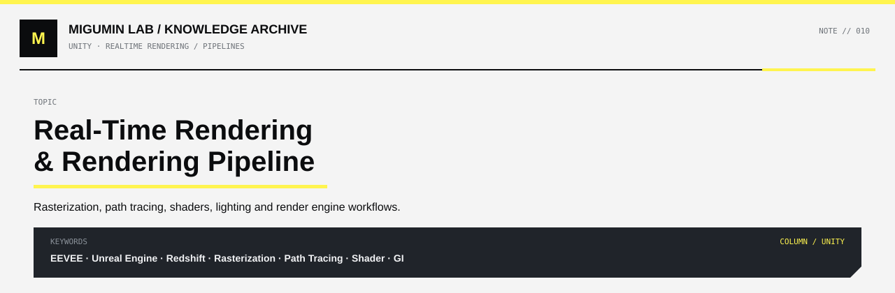

<p align="center">
  
</p>

<p align="center">
  <a href="../README.md#unity">← UNITY</a> ·
  <a href="../README.md#map">KNOWLEDGE MAP</a> ·
  <a href="https://github.com/Retourflow">PROFILE</a>
</p>

---

# 实时渲染与渲染管线学习笔记

> 学习方向：Rendering / Shader TA  
> 核心内容：Blender EEVEE、Unreal Engine、Cinema 4D / Redshift、光栅化、路径追踪、Shader、渲染管线、光照与阴影。  
> 说明：本文用简化模型帮助理解原理。实际引擎中的执行顺序、渲染算法及功能会因版本、渲染模式、平台和设置而不同。

## 核心概念速览

| 概念 | 定义 | 示例 |
|---|---|---|
| 3D 创作软件（DCC） | 创建、编辑模型、动画、材质、场景等内容的软件 | Blender、Cinema 4D（C4D） |
| 游戏引擎 | 管理交互、场景、物理、声音和实时画面等系统的软件 | Unreal Engine（UE）、Unity |
| 渲染引擎（Rendering Engine） | 实现并管理把三维场景转化为画面的渲染系统 | EEVEE、Cycles、Redshift、UE 内部的实时渲染系统 |
| 渲染管线（Rendering Pipeline） | 组织几何处理、可见性、着色、光照和输出等工作的流程 | 一套典型光栅化渲染管线 |
| Shader（着色器） | 在 GPU 上执行特定可编程计算的程序 | Vertex Shader、Pixel / Fragment Shader、Compute Shader |
| 光栅化（Rasterization） | 确定投影到屏幕上的几何图元覆盖哪些采样位置或片元 | EEVEE 和多数游戏实时渲染的基础技术 |
| 光线追踪（Ray Tracing） | 沿光线寻找与场景的交点，可进一步计算遮挡、反射等 | 实时光追、离线渲染 |
| 路径追踪（Path Tracing） | 光线追踪的一类方法：通过采样多条光线路径估算光线传播和最终颜色 | Cycles、Redshift 的主要渲染模式 |
| 实时渲染 | 以较紧的每帧时间预算持续产生画面，满足交互或快速预览要求 | 游戏实时画面、EEVEE 视口 |
| 离线渲染 | 可以花更长时间逐帧计算最终画面，不必在交互时间预算内完成 | 高质量动画和静帧的路径追踪 |

**最重要的关系：Shader 是执行计算的程序；渲染管线组织这些计算与其他图形处理阶段；渲染引擎负责实现、管理和运行渲染系统。**

## Blender、C4D、EEVEE、UE 和 Redshift 的关系

要先区分软件与软件内部的渲染器。**EEVEE 不能直接与整个 Cinema 4D 相提并论。**

```text
Blender（3D 创作软件）
├── EEVEE（以光栅化为基础的实时渲染引擎）
└── Cycles（以路径追踪为核心的渲染引擎）

Cinema 4D / C4D（3D 创作软件）
├── Redshift（以光线追踪／路径追踪为核心的渲染器）
└── 其他渲染选项（因版本与配置而异）

Unreal Engine / UE（游戏引擎）
└── 内置渲染系统
    ├── 通常使用实时光栅化及配套技术
    ├── 可以结合实时光线追踪等功能
    └── 也提供用于非实时高质量输出的路径追踪模式
```

| 对象 | 它是什么 | 典型用途 | 需要避免的误解 |
|---|---|---|---|
| Blender | 3D 创作软件 | 建模、绑定、动画、材质、渲染 | Blender 本身不是单一渲染算法 |
| EEVEE | Blender 的实时渲染引擎 | 视口预览、风格化作品、快速动画输出 | 不是“只有光栅化、没有光照” |
| Cycles | Blender 的路径追踪引擎 | 复杂光照、高质量静帧与动画 | 并不是 Blender 唯一的渲染方式 |
| C4D | 3D 创作软件 | 动态设计、建模、动画、渲染 | “C4D 很慢”不等于所有 C4D 渲染方案都慢 |
| Redshift | 可用于 C4D 等软件的 GPU 加速渲染器 | 高质量图像、动画及交互式预览 | 路径追踪不代表不能优化或快速预览 |
| UE | 包含渲染系统的完整游戏引擎 | 游戏、交互场景、虚拟制作、动画 | UE 不只是一款渲染器，也不只有光栅化 |

## 渲染引擎、渲染管线与 Shader

### 渲染引擎负责什么

渲染引擎负责获取场景信息、管理 GPU 及其他渲染资源、选择或实现算法、准备和调度 Shader、执行渲染工作并输出画面。EEVEE 和 Redshift 都属于渲染引擎，但采用的核心渲染策略不同。

### 渲染管线是什么

渲染管线不是另一个与渲染引擎竞争的软件，而是**渲染工作如何分阶段组织、数据如何在阶段之间流转**。

以下仅是便于理解的典型光栅化流程：

```text
场景与模型数据
       ↓
顶点处理（可以执行 Vertex Shader）
       ↓
图元处理与光栅化（确定三角形覆盖的片元）
       ↓
像素着色（可以执行 Pixel / Fragment Shader）
       ↓
深度、模板测试和混合等处理
       ↓
其他渲染 Pass / 后期处理
       ↓
最终画面
```

真实引擎往往存在多个 Pass：阴影可以先渲染到阴影贴图；光照可能在后续 Pass 中计算；深度测试可提前进行；Compute Shader 也可能在管线中的不同位置执行。因此，上图不是 EEVEE 或 UE 的完整实际顺序。

### Shader 是什么

Shader 是 GPU 执行的可编程计算程序。不同 Shader 承担不同任务：

- **Vertex Shader：** 处理顶点的位置及传递给后续阶段的数据。
- **Pixel / Fragment Shader：** 执行与片元有关的着色计算；材质表面响应、贴图读取等通常与它有关。
- **Compute Shader：** 执行通用 GPU 并行计算，可能用于后处理、光照相关计算或其他工作。

Shader 不等于“贴材质”，也不只是计算颜色。游戏开发中，UE 材质编辑器的节点最终可能被编译进不同的 Shader 阶段，不能简单地认为整个材质图就是一个独立的 Pixel Shader。

### “先制作 Shader，再执行渲染管线”怎样理解

**开发阶段：** 开发者或 TA 先制作材质、编写或配置 Shader；引擎准备、编译并管理相关程序。有大量内置 Shader 不需要 TA 从零编写。

**游戏运行阶段：** 渲染引擎组织渲染管线；管线执行到需要某种 Shader 的阶段时，GPU 才执行相应计算。Shader 不是在管线启动前先把整张图算好。

```text
开发阶段：准备材质 / Shader
                ↓
运行阶段：渲染引擎调度渲染任务
                ↓
         渲染管线执行
         ├── 某些阶段调用 Shader
         ├── 某些阶段使用固定功能硬件
         └── 不同 Pass 相互配合
                ↓
             输出画面
```

**准确表述：在现代游戏常见的可编程光栅化管线中，相应 Shader 是不可缺少的核心部分，但 Shader 并不是所有渲染技术、所有管线阶段都必须拥有的同一种程序。**

## 固定功能管线是否已经淘汰

需要区分两个概念：

- **传统固定功能渲染管线：** 早期 GPU 提供预先规定好的变换、光照等功能，开发者主要配置参数，缺乏现代可编程 Shader 的灵活性。这种完整的旧式工作方式已不再是现代主流游戏渲染方案。
- **现代管线中的固定功能阶段：** 今天依然普遍存在，例如光栅化、某些深度／模板测试和混合操作。这些阶段可以配置，但不是让开发者像编写 Shader 那样完全自由编程其内部逻辑。

所以，“现代可编程管线替代了传统固定功能管线”不等于“现代 GPU 不再使用固定功能硬件”。

## 光栅化究竟在做什么

**光栅化的核心任务，是确定经过几何处理后的三角形覆盖屏幕上的哪些采样位置，生成相应片元。** 它本身不是完整的物理光照算法。

可以把一个球体想成由大量三角形组成：

```text
3D 球体的三角形
       ↓
顶点变换与投影
       ↓
三角形落在屏幕的哪些位置？
       ↓
光栅化生成覆盖的片元
       ↓
Shader、测试及其他渲染步骤
       ↓
形成画面
```

因此，不能说“光栅化自己就把材质、阴影、间接光照全部算完了”。光栅化主要解决屏幕覆盖问题，着色和其他算法继续完成画面。

在现代实时渲染中，光栅化适合高效处理大量可见几何体。UE 与 EEVEE 在技术思路上相似，都是大量利用实时渲染与光栅化；但具体几何处理、着色和光照方案有明显差别。

## 光线追踪与路径追踪在做什么

### 光线追踪

光线追踪通过让光线与场景几何体求交，确定光线击中了什么，进而计算遮挡、反射、折射等现象。它是一类广泛的技术，并不自动等于完整的路径追踪。

### 路径追踪

路径追踪是光线追踪中的一种方法：通常从摄像机向场景追踪光线，寻找与表面的交点，随后依照材质的反射与透射特性继续采样后续路径，并估算照明贡献。

```text
摄像机
  ↓ 发射／采样光线
击中红色球体
  ├── 材质 Shader 决定表面如何响应光线
  ├── 根据采样策略继续追踪反射／透射路径
  ├── 估算直接光照和间接光照
  └── 重复采样以降低噪点
  ↓
累计像素颜色
```

这也是 Redshift 和 Cycles 可以较系统地处理复杂光照的原因之一。但为了降低噪点和提升精度，复杂场景通常需要大量采样，计算成本可能很高。

**路径追踪与 Shader 并不冲突：路径追踪负责采样并追踪光线路径，Shader 则参与计算光线与表面交互时的材质响应等信息。**

## 光照、阴影、反射和全局光照

理解这些内容时，要把**视觉问题**与**实现方法**分开：阴影、反射和间接光照是想得到的效果；阴影贴图、光线追踪、缓存及 Shader 则是实现这些效果的方法。

| 内容 | 要解决的问题 | 常见实现思路 |
|---|---|---|
| 直接光照（Direct Lighting） | 灯光如何直接照亮表面 | 在 Shader 中使用光照模型；根据灯光信息计算 |
| 阴影（Shadow） | 光源是否被其他物体遮挡 | 阴影贴图、阴影追踪、光线追踪等 |
| 反射（Reflection） | 表面能否看到周围环境 | 环境贴图、屏幕空间方法、光线追踪等 |
| 间接光照 / 全局光照（GI） | 光线反弹后如何照亮其他表面 | 缓存／探针、屏幕空间技术、光线追踪、路径追踪等 |
| 后期处理 | 在已有渲染结果上调整或重建画面 | 景深、运动模糊、色调映射、时间重建等 |

### 红球与白墙的例子

假设灯光照亮红色球体，红球反射的部分红光又照到了旁边的白墙。

- **直接光照：** 灯光直接照到球体。
- **间接光照：** 球体反射出的红光进一步照亮白墙，这种颜色渗透（Color Bleeding）是间接光照的例子。
- **阴影：** 球体可能遮挡光源，使地面或墙面上的部分区域变暗。
- **材质响应：** Shader 帮助确定球体如何吸收、反射或透射不同方向的光。

**EEVEE 不会因为以光栅化为基础，就完全缺少光照、阴影、反射或 GI。** 它会使用对应算法以及必要时的部分追踪技术；这些额外算法可能同样通过 Shader 执行。

**Redshift 也包含光照计算。** 路径追踪的一项核心任务，就是估算直接及多次反弹的间接光照，配合材质着色计算最终像素颜色。

### 这些技术不是互相排斥的步骤

不要理解为“光栅化完成 → Shader 完成 → 阴影开始 → 光照开始”的唯一固定顺序。例如：

- 阴影贴图本身可以通过单独的光栅化 Pass 生成。
- 材质着色与光照算法可以在 Shader 内部配合执行。
- 间接光照可能读取缓存，也可能使用部分光线追踪。
- 反射可以混合屏幕空间信息、探针、追踪结果等多种来源。

实际渲染器根据架构、设置和性能目标选择并组织技术。

## 为什么 EEVEE 叫光栅化渲染引擎，Redshift 叫路径追踪渲染器

你在讨论中形成的核心理解是正确的：**通常按照渲染器生成画面的基础方法或核心策略来描述它，而不是要求它只能使用某一种技术。**

### EEVEE：以光栅化为基础

EEVEE 的主要可见几何体处理建立在光栅化之上，再结合材质 Shader、阴影技术、反射、间接光照及后处理等构成完整画面。现代 EEVEE 也具有部分光线追踪相关功能。

因此，“EEVEE 是光栅化引擎”不代表“EEVEE 只有光栅化”。

### Redshift：以光线追踪／路径追踪为核心

Redshift 的核心渲染方式借助光线与几何体求交、后续光线路径采样及材质计算来产生图像和估算复杂光照。它也可以使用优化、缓存、降噪及交互式预览等机制。

因此，“Redshift 是路径追踪渲染器”不代表“Redshift 只能采取昂贵且完全不优化的物理计算”。

| 核心问题 | EEVEE | Redshift |
|---|---|---|
| 主要的可见几何体处理方式 | 光栅化 | 光线追踪 |
| 核心渲染思路 | 快速处理屏幕上的几何与着色，辅以多种视觉效果算法 | 采样并追踪光线路径，结合材质着色估算像素颜色 |
| 会不会计算光照 | 会 | 会 |
| 需不需要 Shader / 材质计算 | 需要相应的可编程计算 | 同样需要材质着色计算 |
| 能否借助其他技术 | 可以使用缓存、追踪及其他算法 | 可以使用缓存、降噪及其他优化 |
| 一定谁更快 | 不能脱离场景、画质和设置直接判断 | 同左 |

## EEVEE 为什么可能比 Redshift 快很多

答案不是“EEVEE 的 GPU 更厉害”，而是：**如果两者采用不同的渲染方案，它们为实现指定视觉效果所需的计算量可能差很多。**

例如，在许多场景中：

- EEVEE 可以通过光栅化迅速确定屏幕上可见的三角形，并利用适合实时渲染的光照、缓存与近似技术呈现画面。
- 路径追踪则会为图像采样大量光线路径，反复处理交点与光的传播，以降低噪点并逼近所使用光照模型的结果。

这些路径采样与求交操作可能需要很多计算时间，因此使用 EEVEE 制作某些风格化动画或快速预览时，会明显节省渲染时间。

但是，不能根据单个创作者的经验断定“EEVEE 一定比 Redshift 快多少倍”：

- 同一场景是否启用了类似的光照、反射、抗锯齿、分辨率等效果，会显著影响成本。
- 路径追踪的采样数、降噪策略和 GPU 配置会影响速度。
- EEVEE 启用更复杂的追踪、阴影和后期效果也会增加计算量。
- C4D 是创作软件；说“C4D 渲染一天”，必须确认实际使用的是哪个渲染器与设置。

**快通常来自选择了不同的算法、近似和质量／性能取舍，而不是 EEVEE 完成了与离线路径追踪完全相同的计算却神奇地快很多。**

## EEVEE 与 UE 实时渲染系统的异同

两者都利用实时渲染思路，也经常以光栅化为基础，再结合 Shader、阴影、反射和间接光照等技术。因此，其基础知识有很强的迁移性。

**两者最容易理解的区别在于主要产品目标，而不是“一个有光照、另一个没有光照”。**

| | EEVEE | UE 实时渲染系统 |
|---|---|---|
| 所属产品 | Blender 创作软件 | 完整游戏引擎 |
| 典型目标 | 实时视口、快速预览、动画及画面输出 | 动态场景、玩家交互、持续实时输出 |
| 常见渲染基础 | 光栅化加其他算法 | 光栅化及多种实时渲染技术 |
| Shader、阴影和 GI | 都可涉及 | 都可涉及 |
| 技术重点 | 创作工作流与输出需求 | 还须兼顾实时交互、场景复杂性和游戏性能预算 |
| 是否能输出高质量动画 | 能 | 能 |

UE 还提供多种面向复杂实时场景的技术，例如 Nanite（虚拟化几何体）、Lumen（动态全局光照及反射）和 TSR（时间超分辨率）。它们各有适用条件和性能成本，不能将其理解为 UE 每次渲染都必须使用的固定步骤。

**EEVEE 不一定比 UE 快，UE 也不一定比 EEVEE 快。** 如果要严肃比较性能，必须在相同硬件、可比场景、目标画质和设置下测试。

## 实时渲染与离线渲染

绝大多数现代交互式 3D 游戏需要实时渲染：玩家移动、转动镜头或改变场景时，画面必须及时更新。

如果目标是 **60 FPS**，每一帧的总时间预算约为 **16.67 ms**。游戏逻辑、渲染及其他系统需要共同满足整体预算，而不是渲染可以独占全部时间。

离线动画渲染则不同：最终视频可以播放为 60 FPS，但制作时，每一帧完全可以花几秒乃至更长时间来计算。这不会改变最终视频播放时的帧率，只会影响制作所需的总渲染时间。

| 问题 | 实时渲染 | 离线渲染 |
|---|---|---|
| 是否通常需要紧凑的帧时间预算 | 是 | 否 |
| 是否允许单帧计算较长时间 | 通常受到严格限制 | 通常可以 |
| 是否必定用光栅化 | 否，但很常见 | 否 |
| 是否能用光线／路径追踪 | 能，受硬件和时间预算限制 | 能，常用于高质量输出 |
| 常见场景 | 游戏、交互内容、实时视口 | 高质量静帧、预渲染动画 |

**“实时／离线”描述时间和交互需求；“光栅化／路径追踪”描述渲染算法。它们不是同一维度的分类。** 某些游戏还支持实时路径追踪模式；一些游戏过场动画则可能播放预先离线渲染好的视频。

## 与 Toon Shader 和 Rendering TA 的关系

你之前研究的 Toon Shader、Normal Map、材质参数和阴影控制，正是理解实时渲染的入口。

- **Toon Shader：** 将连续光照响应处理为离散的明暗色块，可以实现二次元风格。实际风格化角色常需要额外的描边、头发阴影或专门的面部阴影逻辑。
- **Normal / Normal Map：** 影响着色计算使用的表面法线，从而改变光照表现。常规 Normal Map 通常不直接改变模型几何轮廓。
- **Roughness、Metallic 等材质参数：** 改变材质对光的响应，但它们的具体含义取决于引擎使用的着色模型。
- **阴影与光照：** 并不一定全部写在单一材质 Shader 里；实时引擎常将阴影、光照和后处理分成多个 Pass 或系统。
- **性能优化：** TA 不只需要做出效果，还要理解 Shader 计算量、材质复杂度、过度绘制、阴影成本以及相关功能对帧时间的影响。

因此，EEVEE 可以作为学习实时材质、光照和视觉效果的辅助环境；UE 则更适合进一步研究面向游戏的材质工作流、渲染系统及性能分析。二者基础相通，但具体实现并不能直接等同。

## 容易混淆的问题与准确答案

**Shader 是渲染吗？**  
Shader 参与渲染，但不等于全部渲染。完整渲染还涉及几何处理、可见性、资源管理、多个渲染 Pass 与输出等。

**是不是先执行全部 Shader，才执行渲染管线？**  
不是。开发时可以先制作并编译 Shader；运行时则是在渲染管线的相应阶段执行 Shader。

**现代游戏渲染管线一定需要 Shader 吗？**  
在现代游戏常见的可编程图形管线中，相应 Shader 是核心组成部分；但不是每一个阶段都使用 Shader，也不是所有历史或特殊渲染技术都具有相同阶段。

**传统固定功能管线是不是没用了？**  
旧式完整固定功能管线已不再是主流；但现代 GPU 仍大量使用光栅化、深度测试等固定功能阶段。

**EEVEE 是光栅化，所以不计算光照吗？**  
不是。光栅化主要解决几何体覆盖问题，EEVEE 同时包含材质 Shader、灯光、阴影、反射和间接光照等技术。

**Redshift 的路径追踪也包含光照计算吗？**  
包含。路径追踪的核心任务之一，就是通过光线路径采样估算直接与间接光照，并结合材质计算得到像素颜色。

**EEVEE 和 UE 是否属于完全不同的渲染技术？**  
不是。两者的实时渲染有共同基础，但面向的产品、具体算法与资源管理策略不同。

**EEVEE 快，是不是说明 Redshift 算法落后？**  
不是。两者可能追求不同的效果、精度与渲染成本。离线路径追踪更昂贵的计算往往是为了获得复杂场景中的光照表现；实际速度仍须基于同条件测试。

## 最终知识框架

```text
3D 场景
  ↓
渲染引擎（负责实现、管理和运行渲染）
  ↓
渲染管线（组织不同阶段及多个 Pass）
  ├── 几何处理和可见性
  │    ├── 光栅化（EEVEE、许多游戏实时渲染的基础）
  │    └── 光线追踪（Redshift 等的重要基础）
  ├── Shader / 材质响应计算
  ├── 直接光照、阴影、反射与间接光照
  ├── 多种缓存、近似、追踪和降噪策略
  └── 后期处理及输出
       ↓
     最终画面
```

> **记忆要点：** EEVEE 以光栅化为主要基础，但仍包含完整的光照与阴影系统；Redshift 以光线追踪和路径追踪为核心，路径追踪本身就涉及光照估算；UE 的实时渲染系统与 EEVEE 共享许多原理，但还必须处理游戏交互与性能预算。无论哪种引擎，Shader 都是渲染计算的重要工具，而不是独立于渲染管线之外的另一个渲染步骤。