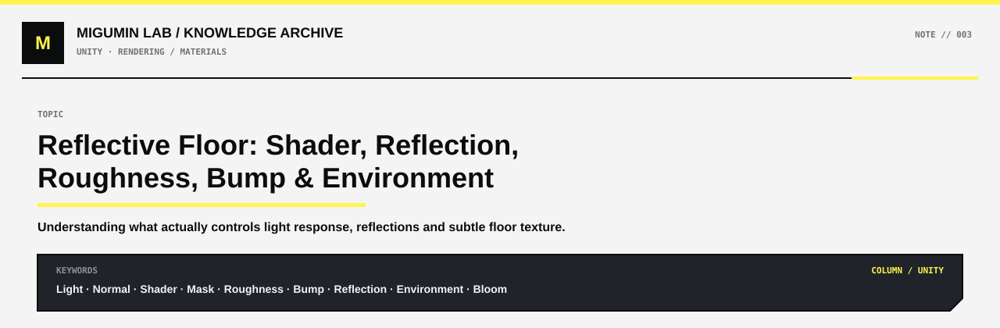

<p align="center">
  
</p>

<p align="center">
  <a href="../README.md#unity">← UNITY</a> ·
  <a href="../README.md#map">KNOWLEDGE MAP</a> ·
  <a href="https://github.com/Retourflow">PROFILE</a>
</p>

---

# 反光地面：Shader、反射、Roughness、Bump 与环境之间的关系

角色渲染里最容易混淆的几组概念，通常是：

- Light
- Normal
- Shader
- Mask
- Roughness
- Bump / Normal Map
- Reflection
- Bloom / Glare
- Background / Environment

它们并不是同一层级的东西。

最核心的一句话是：

> **Light 提供光，Normal 告诉 Shader 表面朝哪里，Shader 决定表面如何响应光，Mask 决定哪些区域使用哪些规则；Roughness、Bump、Normal Map 等参数则进一步改变这种响应。**

---

# 一、Light：负责“光从哪里来”

Light 是整个光照系统的输入。

它主要决定：

- 光从哪个方向照过来
- 光有多亮
- 光源有多大
- 光是什么颜色
- 阴影朝哪里
- 阴影是硬还是软
- 高光整体有多强

以 Blender 的 Area Light 为例：

- `Power` 越大，整体照明和高光通常越强
- `Size` 越大，高光往往越宽、越柔
- `Size` 越小，高光往往越集中、越锐利

所以如果一个角色的：

- 头发
- 手套
- 衣服
- 金属饰品
- 皮肤

同时出现大面积发白，优先检查：

- 主光 Power
- Area Light Size
- Exposure
- Bloom / Glare
- Shader 的统一高光参数

而不是优先怀疑每一个材质 Mask 都坏了。

---

# 二、Normal：负责“表面朝哪里”

Normal 的本质是一个方向。

模型表面上的每一个点，都有一个 Normal。

Shader 会根据：

- Light 方向
- Normal 方向

判断这个表面是：

- 正对光
- 斜对光
- 背对光

从而决定明暗。

可以简单理解成：

```text
Normal 正对光
→ 更亮

Normal 与光线夹角变大
→ 更暗

Normal 背对光
→ 进入暗部
```

所以 Normal 是光照计算最基础的输入之一。

---

# 三、Normal Map：模型没变，但光照看起来变了

Normal Map 通常不会直接改变几何体。

它改变的是：

> **Shader 认为这个表面朝哪个方向。**

例如一个真正完全平整的平面，本来所有 Normal 都一致：

```text
↑ ↑ ↑ ↑ ↑
```

加入 Normal Map 后，Shader 可能会把它理解成：

```text
↖ ↑ ↗ ← ↘
```

几何体仍然可能是平的，但视觉上会出现：

- 细小明暗
- 凹凸感
- 高光变化
- 表面纹理

因此：

> **看起来有凹凸，不一定真的存在几何凹凸。**

---

# 四、Bump：也是在“骗 Shader”

Bump 和 Normal Map 的核心目的类似：

> **不真正改变大形体，而是改变光照对表面的理解。**

常见用途包括：

- 地面细纹
- 布料纹理
- 石材颗粒
- 皮肤细节
- 金属拉丝
- 微小磨损
- 漆面细小起伏

如果 Bump 太强，常见结果是：

- 平滑地面变成水波
- 金属像皱纸
- 塑料像橘皮
- 材质显得很脏

很多高级材质的特点不是“凹凸很多”，而是：

> **凹凸非常弱，但确实存在。**

---

# 五、Shader：真正决定“光打上去以后长什么样”

Shader 可以理解成：

> **一套“表面如何响应光”的规则。**

Light 只是提供光。

Normal 只是提供表面方向。

Shader 才负责把这些信息变成：

- 明面
- 暗面
- 高光
- 反射
- 金属感
- 粗糙感
- Fresnel
- Rim Light
- Toon 阴影
- 发丝高光
- 皮肤效果
- 布料效果

同一束光照到不同 Shader 上，结果可以完全不同。

---

# 六、Mask：通常不负责“算光”，而是负责“分区和限制规则”

Mask 本质上是一张区域信息图。

最简单的理解：

```text
白色
→ 执行某种效果

黑色
→ 不执行

灰色
→ 部分执行
```

Mask 常用来控制：

- 哪些地方是皮肤
- 哪些地方是头发
- 哪些地方是金属
- 哪些地方出现高光
- 哪些地方 Roughness 更低
- 哪些地方使用特殊阴影
- 哪些地方允许 Rim Light
- 哪些地方进入特殊 Toon Shader 规则

因此：

> **Mask 通常不负责判断光从哪里来。**

它更像：

> **告诉 Shader：这里该使用哪套规则。**

---

# 七、Mask 和光照并不是完全没关系

Mask 虽然通常不负责计算光照方向，但可以强烈改变最终结果。

例如：

```text
Mask 白色区域
→ 高光强度 1

Mask 黑色区域
→ 高光强度 0
```

最终看起来就会像：

- 某些地方有高光
- 某些地方完全没有高光

所以要区分：

> **Mask 负责限制规则。**

> **Shader 负责执行规则。**

---

# 八、二次元 Shader 里，Mask 往往比写实材质更重要

写实材质主要依赖：

- Light
- Normal
- Roughness
- Metallic
- Specular

但二次元角色经常加入大量人为控制：

- 脸部阴影 Mask
- 头发高光 Mask
- 材质 ID Mask
- 金属 Mask
- Rim Light Mask
- 阴影颜色 Mask
- 特殊脸部光照贴图

原因很简单：

> **真实光照不一定自动产生好看的二次元结果。**

所以很多二次元 Shader 会：

1. 先计算基础光照
2. 再利用 Mask 和人为规则重塑明暗、高光和阴影

---

# 九、Roughness：决定反射和高光有多“散”

Roughness 是理解材质的核心参数之一。

简单来说：

```text
Roughness 低
→ 表面更光滑
→ 反射更清楚
→ 高光更集中

Roughness 高
→ 表面更粗糙
→ 反射更模糊
→ 高光更分散
```

常见感受：

```text
Roughness ≈ 0
→ 接近镜面

Roughness ≈ 0.1
→ 强烈、锐利、高反射

Roughness ≈ 0.3
→ 高光开始明显变宽

Roughness ≈ 0.7
→ 高光很散

Roughness ≈ 1
→ 接近完全粗糙
```

---

# 十、光源 Size 和 Roughness 都会让高光“变大”，但原因不同

这两个非常容易混淆。

## Area Light Size 变大

意味着：

> **光源本身面积变大。**

结果通常是：

- 高光更宽
- 高光边缘更柔
- 阴影更软

---

## Roughness 变大

意味着：

> **材质表面把反射打散了。**

结果通常是：

- 高光更模糊
- 反射更散
- 细节更少

所以：

> **Light Size 大，是光源本身大。**

> **Roughness 大，是材质把光打散。**

两者都会让高光变宽，但本质完全不同。

---

# 十一、反光地面为什么会反光

反光地面的核心，不是 Noise，也不是 Bump。

真正让地面“能反光”的，是：

> **Shader 的镜面反射能力。**

在最普通的 Principled BSDF 中，只要表面足够光滑，Roughness 足够低，就可以产生明显反射。

例如：

```text
Base Color
→ 深灰 / 接近黑色

Roughness
→ 较低
```

一个简单的黑色 Plane 就可以变成很强的反光地面。

---

# 十二、黑色地面为什么还能很亮

这是非常重要的一点：

> **Base Color 很暗，不代表最终画面一定暗。**

一个接近黑色的材质，如果：

- Roughness 很低
- 环境里有很亮的东西
- 入射角合适

仍然可以出现非常亮的反射。

所以科幻地面经常采用：

```text
深色 Base Color
+
低 Roughness
+
亮环境
```

最终看起来会：

- 整体很黑
- 但反射非常漂亮
- 高光很强
- 画面仍然有层次

---

# 十三、Shader 不能凭空制造倒影

这是反射里最重要的逻辑之一。

Shader 只能决定：

> **“这个表面有多会反射。”**

但它不能决定：

> **“反射内容从哪里来。”**

也就是说：

```text
镜子很会反光
```

不代表：

```text
镜子可以凭空生成倒影
```

场景里必须真的存在：

- 模型
- 环境
- HDRI
- 背景几何体
- 可被反射采样到的图像内容

Shader 才有东西可以反射。

---

# 十四、Camera Background 和真实场景背景不是一回事

在 Blender 里，如果只是把图片当成：

> **Camera Background Image**

它更多只是给你“看”的。

它不一定真正参与：

- 光照
- 反射
- 阴影
- 环境采样

因此地面未必会自动反射这张背景。

如果希望地面反射背景内容，通常要让背景真正进入场景，例如：

- 放到一个 Plane 上
- 放到巨大的背景几何体上
- 作为 World / Environment Texture
- 使用专门的反射环境

核心原则是：

> **反射系统必须真的“看得到”那个背景。**

---

# 十五、为什么地面会出现竖向亮柱

很多科幻场景里，地面会出现：

- 纵向白光
- 长条形反射
- 被拉开的亮区

这些不一定是地面贴图。

更常见的是：

> **背景中的高亮区域，被低 Roughness 地面反射下来。**

例如背景里有：

- 地球边缘
- 白云
- 大气层
- 超亮天空
- 灯带
- 发光建筑

地面把这些高亮反射下来，就会自然形成亮柱。

所以：

> **地面上的亮纹，不一定来自地面本身。**

有时它只是环境的镜面反射。

---

# 十六、为什么反光地面还要加 Bump

如果地面只使用：

```text
低 Roughness
```

它容易变成：

> **过于完美的镜子。**

现实中的很多高级抛光表面，都不是数学意义上的完美平面。

所以可以加入非常弱的：

- Bump
- Normal
- Surface Noise

来轻微扰动反射。

结果会从：

```text
完美、笔直、非常干净的镜像
```

变成：

```text
依旧顺滑
但反射有非常轻微的破碎、抖动和质感
```

这就是很多科幻地面的高级感来源。

---

# 十七、Noise 不是用来“制造反光”的

Noise 经常被误解。

Noise 本身不会让地面突然拥有反射能力。

它通常被用来控制：

- Bump
- Roughness
- Normal
- Color Variation

所以：

```text
Noise
→ Bump
```

真正做的是：

> **扰动表面方向。**

而不是：

> **制造镜面反射。**

反射的核心仍然是 Shader。

---

# 十八、非常细的横向纹理怎么做

如果地面的纹理不是随机颗粒，而是：

> **很细、很长、几乎横向延伸的微纹**

常见做法是：

```text
Texture Coordinate
↓
Mapping
↓
Noise Texture
↓
ColorRamp
↓
Bump
```

关键点在 Mapping。

把 Noise 在一个方向严重拉伸：

```text
X：1
Y：100
Z：1
```

或者相反，具体取决于平面方向。

这样原本随机的 Noise 就会变成：

```text
────────────
────────────────
──── ─────────
────────────────
```

类似细长拉丝或极弱地表纹理。

---

# 十九、Roughness Variation：让地面不再“死”

如果整块地面 Roughness 完全一样，例如：

```text
Roughness = 0.15
```

很容易显得太计算机化。

更自然的方式是：

```text
局部 Roughness
0.12
0.14
0.17
0.19
```

但变化幅度要非常小。

这样反射会出现轻微差异：

- 有的地方更清晰
- 有的地方更柔
- 有的地方高光稍微扩散

这种效果叫：

> **Roughness Variation**

它往往比单纯增加大凹凸更高级。

---

# 二十、顺滑地面 + 轻微凹凸的完整逻辑

一个典型的科幻反光地面，可以理解为：

```text
Plane
↓
Principled BSDF
↓
深色 Base Color
↓
低 Roughness
↓
产生反射
```

然后额外加入：

```text
Noise
↓
轻微 Bump
```

让反射产生细微变化。

再加入：

```text
Noise / Texture
↓
轻微 Roughness Variation
```

让表面不完全一致。

最终效果：

> **远看非常平整。**

> **近看有一点点纹理。**

> **反射清晰，但又不至于像完美镜子。**

---

# 二十一、Metallic 不是反光开关

一个常见误区是：

> “想要反光，就把 Metallic 拉高。”

实际上不是。

非金属材质一样可以有很强的镜面反射。

例如：

- 玻璃
- 漆面
- 湿地面
- 塑料
- 抛光石材

它们都不是金属，但一样可以非常亮。

Metallic 决定的是：

> **表面是不是按照金属的方式反射光。**

而不是：

> **表面有没有反射。**

所以做黑色抛光地面时：

- Metallic 可以为 0
- 也可以根据材质设定稍微增加

但真正决定“镜不镜”的关键仍然是 Roughness 和 Shader。

---

# 二十二、地面纹理有三种层级

## 微小纹理

使用：

- Bump
- Normal Map
- Roughness Variation

例如：

- 微细划痕
- 拉丝
- 轻微起伏
- 表面颗粒

---

## 中等形变

可以使用：

- Displacement
- Tessellation
- Geometry

例如：

- 比较明显的裂纹
- 地表隆起
- 中尺度不平

---

## 大型结构

应该直接建模。

例如：

- 台阶
- 坑
- 大裂缝
- 平台高度变化

所以：

> **“看起来有一点点凹凸”并不意味着应该真的把地面模型做得坑坑洼洼。**

---

# 二十三、Bloom / Glare 不属于材质本身

Bloom 和 Glare 是后期。

它们不会决定：

> **表面本身有没有高光。**

它们做的是：

> **把已经很亮的区域向周围扩散。**

流程可以理解成：

```text
Light
↓
Shader 产生高亮
↓
高亮超过阈值
↓
Bloom / Glare 扩散
↓
看起来像发光
```

所以角色如果已经有很强的高光，再叠加 Bloom，可能会出现：

- 白光扩散
- 材质边界被吃掉
- 黑色材质泛白
- 整体像在发光

---

# 二十四、曝光过高会“吃掉材质区别”

如果曝光太高：

原本不同强度的高光，例如：

```text
头发：0.8
布料：0.9
金属：1.1
```

最后都可能压到接近纯白：

```text
1.0
1.0
1.0
```

结果就是：

- 材质差异消失
- 高光连成一片
- 颜色失真
- 黑色区域被抬亮
- 角色失去层次

---

# 二十五、为什么“所有材质都亮”通常先查灯光

如果：

- 头发亮
- 手套亮
- 金属亮
- 布料亮
- 皮肤也亮

那么这种“全局性问题”通常首先检查：

- Light Power
- Light Size
- Exposure
- Tonemapping
- Bloom / Glare
- Shader 的全局高光设置

如果只有：

- 某块金属异常
- 某片头发高光奇怪
- 某个区域完全不受光

再去检查：

- Mask
- Normal
- Roughness
- Specular
- Material ID

---

# 二十六、判断渲染问题时的排查顺序

## 整个角色都偏亮

检查：

- Light
- Exposure
- Tonemapping

---

## 所有高光都特别宽

检查：

- Area Light Size
- Roughness
- Shader 高光模型

---

## 所有亮部周围都有光晕

检查：

- Bloom
- Glare
- 后期合成

---

## 只有一种材质异常

检查：

- Roughness
- Metallic
- Specular
- 对应 Mask

---

## 只有一个局部区域异常

检查：

- Mask
- Normal
- Normal Map
- 顶点法线
- UV / Texture

---

## 地面反射太像镜子

检查：

- Roughness 是否太低
- 是否缺少 Bump
- 是否缺少 Roughness Variation

---

## 地面根本没有背景倒影

检查：

- 背景是否真正存在于可反射场景中
- 是否只是 Camera Background
- World / Environment 是否正确
- 渲染器的反射设置是否开启

---

# 二十七、整个渲染流程可以压缩成这样

```text
Light
提供光的方向、强度、颜色
        ↓
Normal
告诉 Shader 表面朝哪里
        ↓
Shader
计算明暗、高光、反射
        ↓
Mask
限制不同区域使用不同规则
        ↓
Roughness / Metallic / Specular
进一步决定材质表现
        ↓
Bump / Normal Map
制造微表面变化
        ↓
Environment / Scene
提供可被反射的内容
        ↓
Exposure / Bloom / Glare / Tonemapping
处理最终画面
```

---

# 二十八、最值得记住的几句话

> **Light 决定光从哪里来。**

> **Normal 决定表面朝哪里。**

> **Shader 决定表面如何响应光。**

> **Mask 决定哪些区域使用哪些规则。**

> **Roughness 决定反射和高光有多集中。**

> **Bump / Normal Map 决定微表面如何扰动光。**

> **Environment 决定表面到底能反射到什么。**

> **Bloom / Glare 只是在最终画面里把亮部继续扩散。**

---

# 二十九、一个最实用的判断原则

遇到渲染问题时，先判断：

> **这是“整个角色 / 整个材质系统”的问题，还是“某个局部区域”的问题？**

如果是全局：

> **先查 Light、Shader、Exposure、Tonemapping、Bloom。**

如果是局部：

> **再查 Mask、Normal、Roughness、材质参数。**

如果是反射：

> **再额外检查场景里到底有没有真正可被反射的内容。**

这比一看到问题就盲目改 Mask 或乱调节点有效得多。